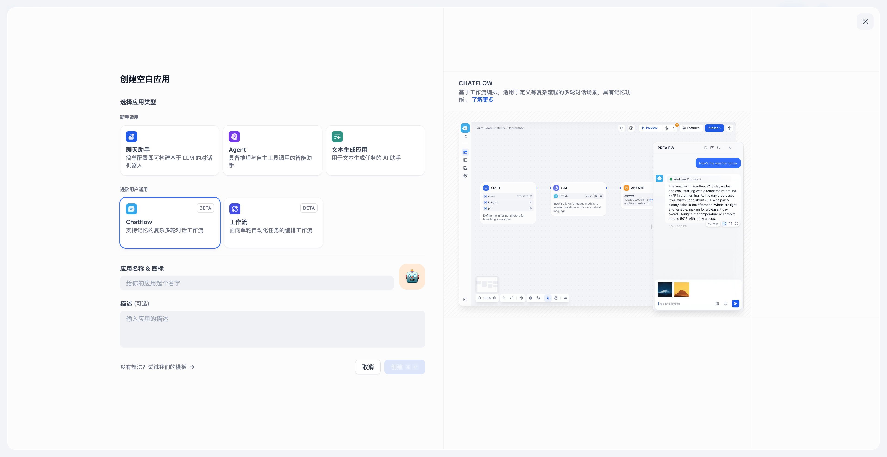
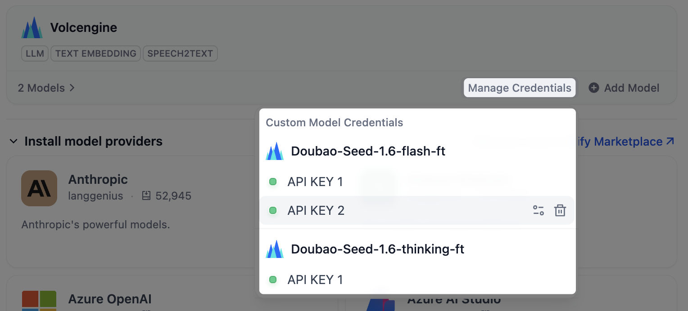
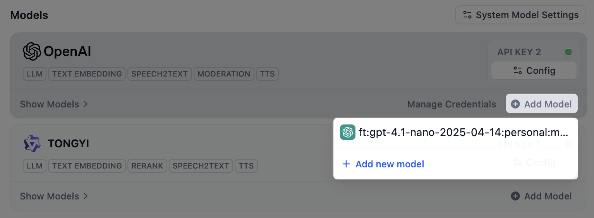
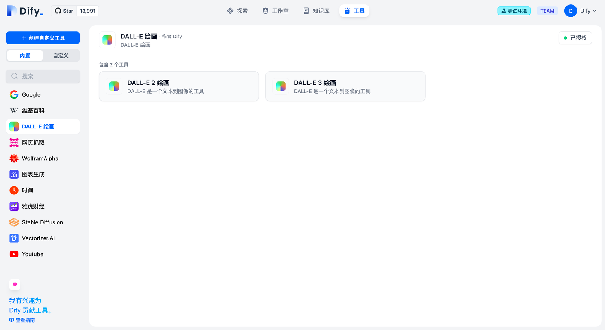
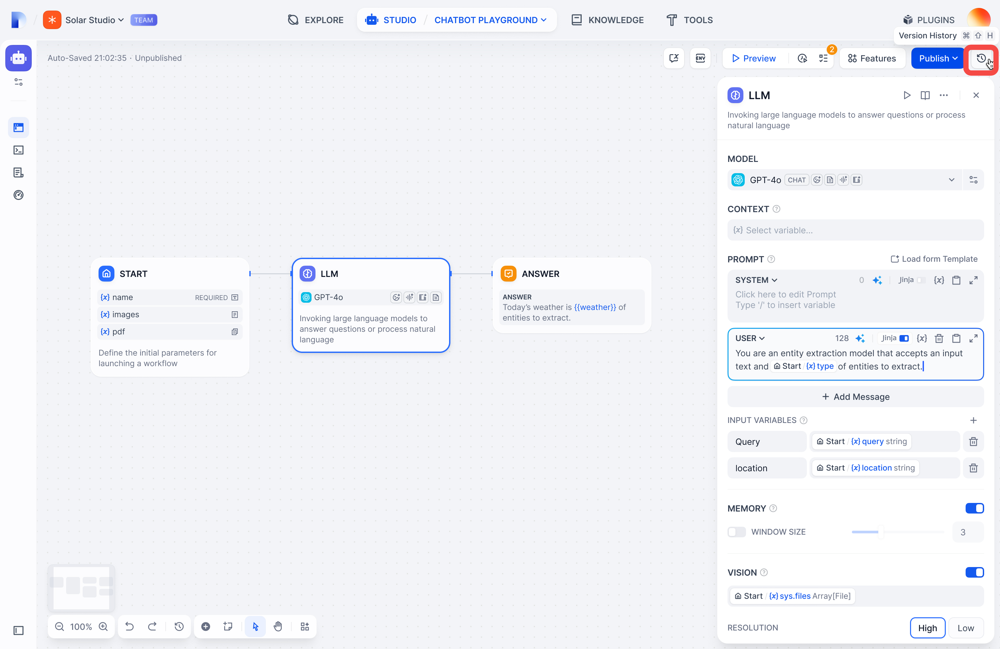
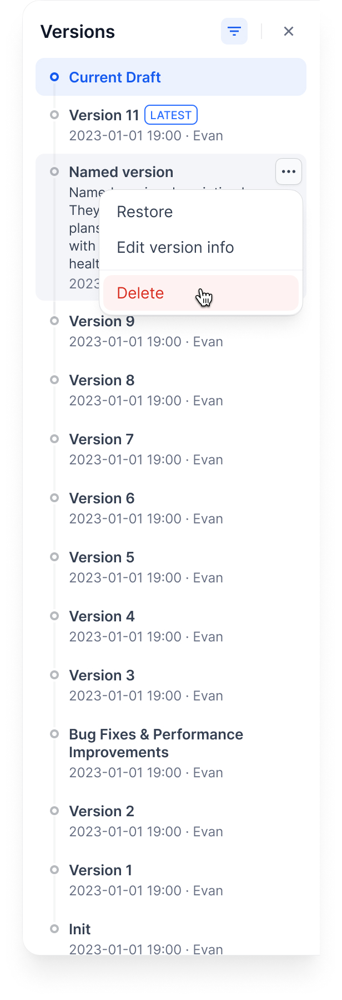

# 智能体平台方案文档

Dify 智能体平台提供从数据治理、模型调度到业务运营的一站式能力。
本文档整合官方中文资料，按照投标要求梳理平台定位、业务流程、技术架构及各系统模块的实现细节。

## 平台概述

本章节聚焦项目背景与核心目标，明确平台建设的价值主张与应用场景。

### 项目背景

**Dify** 是一款开源的大语言模型（LLM）应用开发平台。它融合了后端即服务（Backend as Service）和 [LLMOps](learn-more/extended-reading/what-is-llmops) 的理念，使开发者可以快速搭建生产级的生成式 AI 应用。即使你是非技术人员，也能参与到 AI 应用的定义和数据运营过程中。

由于 Dify 内置了构建 LLM 应用所需的关键技术栈，包括对数百个模型的支持、直观的 Prompt 编排界面、高质量的 RAG 引擎、稳健的 Agent 框架、灵活的工作流，并同时提供了一套易用的界面和 API。这为开发者节省了许多重复造轮子的时间，使其可以专注在创新和业务需求上。

### 为什么使用 Dify？

你或许可以把 LangChain 这类的开发库（Library）想象为有着锤子、钉子的工具箱。与之相比，Dify 提供了更接近生产需要的完整方案，Dify 好比是一套脚手架，并且经过了精良的工程设计和软件测试。

重要的是，Dify 是**开源**的，它由一个专业的全职团队和社区共同打造。你可以基于任何模型自部署类似 Assistants API 和 GPTs 的能力，在灵活和安全的基础上，同时保持对数据的完全控制。

> 我们的社区用户对 Dify 的产品评价可以归结为简单、克制、迭代迅速。
> ——路宇，Dify.AI CEO

希望以上信息和这份指南可以帮助你了解这款产品，我们相信 Dify 是为你而做的（Do It For You）。

### 核心目标


> **信息提示：**

Dify 一词源自 Define + Modify，意指定义并且持续的改进你的 AI 应用，它是为你而做的（Do it for you）。

* **创业**，快速的将你的 AI 应用创意变成现实，无论成功和失败都需要加速。在真实世界，已经有几十个团队通过 Dify 构建 MVP（最小可用产品）获得投资，或通过 POC（概念验证）赢得了客户的订单。
* **将 LLM 集成至已有业务**，通过引入 LLM 增强现有应用的能力，接入 Dify 的 RESTful API 从而实现 Prompt 与业务代码的解耦，在 Dify 的管理界面是跟踪数据、成本和用量，持续改进应用效果。
* **作为企业级 LLM 基础设施**，一些银行和大型互联网公司正在将 Dify 部署为企业内的 LLM 网关，加速 GenAI 技术在企业内的推广，并实现中心化的监管。
* **探索 LLM 的能力边界**，即使你是一个技术爱好者，通过 Dify 也可以轻松的实践 Prompt 工程和 Agent 技术，在 GPTs 推出以前就已经有超过 60,000 开发者在 Dify 上创建了自己的第一个应用。

## 总体设计

总体设计部分说明智能体平台的定位、应用类型与交付形态，为后续业务方案奠定基础。

### 核心定位

在 Dify 中，一个“应用”是指基于 GPT 等大语言模型构建的实际场景应用。通过创建应用，你可以将智能 AI 技术应用于特定的需求。它既包含了开发 AI 应用的工程范式，也包含了具体的交付物。

简而言之，一个应用为开发者交付了：

* 封装友好的 API，可由后端或前端应用直接调用，通过 Token 鉴权
* 开箱即用、美观且托管的 WebApp，你可以 WebApp 的模板进行二次开发
* 一套包含提示词工程、上下文管理、日志分析和标注的易用界面

你可以任选**其中之一**或**全部**，来支撑你的 AI 应用开发。

### 应用类型

Dify 中提供了五种应用类型：

* **聊天助手**：基于 LLM 构建对话式交互的助手
* **文本生成应用**：面向文本生成类任务的助手，例如撰写故事、文本分类、翻译等
* **Agent**：能够分解任务、推理思考、调用工具的对话式智能助手
* **对话流**：适用于定义等复杂流程的多轮对话场景，具有记忆功能的应用编排方式
* **工作流**：适用于自动化、批处理等单轮生成类任务的场景的应用编排方式

文本生成应用与聊天助手的区别见下表：

<table><thead><tr><th width="180.33333333333331"></th><th>文本生成应用</th><th>聊天助手</th></tr></thead><tbody><tr><td>WebApp 界面</td><td>表单+结果式</td><td>聊天式</td></tr><tr><td>WebAPI 端点</td><td><code>completion-messages</code></td><td><code>chat-messages</code></td></tr><tr><td>交互方式</td><td>一问一答</td><td>多轮对话</td></tr><tr><td>流式结果返回</td><td>支持</td><td>支持</td></tr><tr><td>上下文保存</td><td>当次</td><td>持续</td></tr><tr><td>用户输入表单</td><td>支持</td><td>支持</td></tr><tr><td>知识库与插件</td><td>支持</td><td>支持</td></tr><tr><td>AI 开场白</td><td>不支持</td><td>支持</td></tr><tr><td>情景举例</td><td>翻译、判断、索引</td><td>聊天</td></tr></tbody></table>

---

## 业务流设计

业务流设计覆盖数据接入、知识构建到智能应用交付的端到端路径，确保业务需求能够在平台内顺畅落地。

### 数据源与接入方法

轻点 Dify 平台顶部导航中 **"知识库"** → "**创建知识库"**。你可以通过上传本地文件或导入在线数据两种方式上传文档至知识库内。

### **上传本地文件**

拖拽或选中文件进行上传，**支持批量上传**，同时上传的文件数量限制取决于[订阅计划](https://dify.ai/pricing)。

**本地上传文档文件存在以下限制：**

* 单文档的上传大小限制为 **15MB**
* 不同 SaaS 版本的[订阅计划](https://dify.ai/pricing)限定了**批量上传个数、文档上传总数、向量存储空间**


### **导入在线数据**

创建知识库时支持通过在线数据导入。知识库支持导入以下两种在线数据：

- **从 Notion 导入**（链接：./sync-from-notion）

  了解如何从 Notion 导入数据

- **从网站导入**（链接：./sync-from-website）

  了解如何从网站导入数据

引用在线数据的知识库后续无法新增本地文档，也无法变更为本地文件类型的知识库，以防止单一知识库存在多种数据来源而造成管理困难。

### 后续导入

如果还没有准备好文档或其它内容数据，可以先创建一个空知识库，在后续上传本地文档或导入在线数据。

---

### 知识化处理与构建方法

知识流水线是构建处理文档流程的一种解决方案，你能够像编排工作流一样对不同节点进行可视化地组合和配置，并选择使用不同工具来优化数据处理过程。

它主要包含四个环节，每个环节由不同的节点和工具组成，形成完整的数据处理链路：

**数据源 → 数据提取 → 数据处理 → 知识库存储**

每个步骤都有特定的用途：从各种来源收集内容，将其转换为可处理的文本，优化以便搜索，并以能够快速、准确检索的格式进行存储。

此外，Dify 还提供不同使用场景的知识流水线模板，帮助提升数据索引和检索结果的准确度。本章节将帮助你了解知识流水线的创建方式、流程以及相应节点，让你能快速搭建和优化自己的知识库。

> **步骤：**

- **步骤一：创建知识流水线**（链接：./create-knowledge-pipeline）

      从内置模板、空白知识库流水线开始创建，或导入现有流水线。

- **步骤二： 编排知识流水线**（链接：./knowledge-pipeline-orchestration）

      了解知识库流水线的工作原理，编排不同节点，构建你需要的的数据处理流程。

- **步骤三：发布知识流水线**（链接：./publish-knowledge-pipeline）

      测试配置无误后，发布流水线，准备进行文档处理。

- **步骤四：上传文件**（链接：./upload-files）

      添加文档，经过处理后构建成可搜索的知识库。

- **步骤五：管理和使用知识库**（链接：./manage-knowledge-base）

      日常维护文档、测试检索效果、修改设置等。

---

### 数据清洗与分段策略

将内容上传至知识库后，接下来需要对内容进行分段与数据清洗。**该阶段是内容的预处理与数据结构化过程，长文本将会被划分为多个内容分段。**

* **分段**

由于大语言模型的上下文窗口有限，无法一次性处理和传输整个知识库的内容，因此需要对文档中的长文本分段为内容块。即便部分大模型已支持上传完整的文档文件，但实验表明，检索效率依然弱于检索单个内容分段。

LLM 能否精准地回答出知识库中的内容，关键在于知识库对内容块的检索与召回效果。类似于在手册中查找关键章节即可快速得到答案，而无需逐字逐句分析整个文档。经过分段后，知识库能够基于用户问题，采用分段 TopK 召回模式，召回与问题高度相关的内容块，补全关键信息从而提高回答的精准性。

在进行问题与内容块的语义匹配时，合理的分段大小非常关键，它能够帮助模型准确地找到与问题最相关的内容，减少噪音信息。过大或过小的分段都可能影响召回的效果。

Dify 提供了 **"通用分段"** 和 **"父子分段"** 两种分段模式，分别适应不同类型的文档结构和应用场景，满足不同的知识库检索和召回的效率与准确性要求。

* **清洗**

为了保证文本召回的效果，通常需要在将数据录入知识库之前便对其进行清理。例如，文本内容中存在无意义的字符或者空行可能会影响问题回复的质量，需要对其清洗。Dify 已内置的自动清洗策略，详细说明请参考 [ETL](./zh-hans/guides/knowledge-base/create-knowledge-and-upload-documents/chunking-and-cleaning-text)。

LLM 收到用户问题后，能否精准地回答出知识库中的内容，取决于知识库对内容块的检索和召回效果。匹配与问题相关度高的文本分段对 AI 应用生成准确且全面的回应至关重要。

好比在智能客服场景下，仅需帮助 LLM 定位至工具手册的关键章节内容块即可快速得到用户问题的答案，而无需重复分析整个文档。在节省分析过程中所耗费的 Tokens 的同时，提高 AI 应用的问答质量。

### 分段模式

知识库支持两种分段模式：**通用模式**与**父子模式**。如果你是首次创建知识库，建议选择父子模式。

> **信息提示：**

**注意**：原 **"自动分段与清洗"** 模式已自动更新为 **"通用"** 模式。无需进行任何更改，原知识库保持默认设置即可继续使用。选定分段模式并完成知识库的创建后，后续无法变更。知识库内新增的文档也将遵循同样的分段模式。


#### 通用模式

系统按照用户自定义的规则将内容拆分为独立的分段。当用户输入问题后，系统自动分析问题中的关键词，并计算关键词与知识库中各内容分段的相关度。根据相关度排序，选取最相关的内容分段并发送给 LLM，辅助其处理与更有效地回答。

在该模式下，你需要根据不同的文档格式或场景要求，参考以下设置项，手动设置文本的**分段规则**。

* **分段标识符**，默认值为 `\n`，即按照文章段落进行分块。你可以遵循[正则表达式语法](https://regexr.com/)自定义分块规则，系统将在文本出现分段标识符时自动执行分段。例如  的含义是按照句子进行分段。下图是不同语法的文本分段效果：


* **分段最大长度**，指定分段内的文本字符数最大上限，超出该长度时将强制分段。默认值为 500 Tokens，分段长度的最大上限为 4000 Tokens；
* **分段重叠长度**，指的是在对数据进行分段时，段与段之间存在一定的重叠部分。这种重叠可以帮助提高信息的保留和分析的准确性，提升召回效果。建议设置为分段长度 Tokens 数的 10-25%；

**文本预处理规则，** 过滤知识库内部分无意义的内容。提供以下选项：

* 替换连续的空格、换行符和制表符
* 删除所有 URL 和电子邮件地址

配置完成后，点击"预览区块"即可查看分段后的效果。你可以直观的看到每个区块的字符数。如果重新修改了分段规则，需要重新点击按钮以查看新的内容分段。

若同时批量上传了多个文档，轻点顶部的文档标题，快速切换并查看其它文档的分段效果。


分段规则设置完成后，接下来需指定索引方式。支持"高质量索引"和"经济索引"，详细说明请参考[设定索引方法](./zh-hans/guides/knowledge-base/create-knowledge-and-upload-documents/setting-indexing-methods)。

#### **父子模式**

与**通用模式**相比，父子模式采用双层分段结构来平衡检索的精确度和上下文信息,让精准匹配与全面的上下文信息二者兼得。

其中，父区块（Parent-chunk）保持较大的文本单位（如段落），提供丰富的上下文信息；子区块（Child-chunk）则是较小的文本单位（如句子），用于精确检索。系统首先通过子区块进行精确检索以确保相关性，然后获取对应的父区块来补充上下文信息，从而在生成响应时既保证准确性又能提供完整的背景信息。你可以通过设置分隔符和最大长度来自定义父子区块的分段方式。

例如在 AI 智能客服场景下，用户输入的问题将定位至解决方案文档内某个具体的句子，随后将该句子所在的段落或章节，联同发送至 LLM，补全该问题的完整背景信息，给出更加精准的回答。

其基本机制包括：

* **子分段匹配查询**：
  * 将文档拆分为较小、集中的信息单元（例如一句话），更加精准的匹配用户所输入的问题。
  * 子分段能快速提供与用户需求最相关的初步结果。
* **父分段提供上下文**：
  * 将包含匹配子分段的更大部分（如段落、章节甚至整个文档）视作父分段并提供给大语言模型（LLM）。
  * 父分段能为 LLM 提供完整的背景信息，避免遗漏重要细节，帮助 LLM 输出更贴合知识库内容的回答。


在该模式下，你需要根据不同的文档格式或场景要求，手动分别设置父子分段的**分段规则**。

**父分段：**

父分段设置提供以下分段选项：

* **段落**

根据预设的分隔符规则和最大块长度将文本拆分为段落。每个段落视为父分段，适用于文本量较大，内容清晰且段落相对独立的文档。支持以下设置项：

* **分段标识符**，默认值为 `\n`，即按照文本段落分段。你可以遵循[正则表达式语法](https://regexr.com/)自定义分块规则，系统将在文本出现分段标识符时自动执行分段。
* **分段最大长度**，指定分段内的文本字符数最大上限，超出该长度时将强制分段。默认值为 500 Tokens，分段长度的最大上限为 4000 Tokens；

* **全文**

不进行段落分段，而是直接将全文视为单一父分段。出于性能原因，仅保留文本内的前 10000 Tokens 字符，适用于文本量较小，但段落间互有关联，需要完整检索全文的场景。


**子分段：**

子分段文本是在父文本分段基础上，由分隔符规则切分而成，用于查找和匹配与问题关键词最相关和直接的信息。如果使用默认的子分段规则，通常呈现以下分段效果：

* 当父分段为段落时，子分段对应各个段落中的单个句子。
* 父分段为全文时，子分段对应全文中各个单独的句子。

在子分段内填写以下分段设置：

* **分段标识符**，默认值为 ，即按照句子进行分段。你可以遵循[正则表达式语法](https://regexr.com/)自定义分块规则，系统将在文本出现分段标识符时自动执行分段。
* **分段最大长度**，指定分段内的文本字符数最大上限，超出该长度时将强制分段。默认值为 200 Tokens，分段长度的最大上限为 4000 Tokens；

你还可以使用**文本预处理规则**过滤知识库内部分无意义的内容：

* 替换连续的空格、换行符和制表符
* 删除所有 URL 和电子邮件地址

配置完成后，点击"预览区块"即可查看分段后的效果。你可以查看父分段的整体字符数。背景标蓝的字符为子分块，同时显示当前子段的字符数。

如果重新修改了分段规则，需要重新点击"预览区块"按钮以查看新的内容分段。若同时批量上传了多个文档，轻点顶部的文档标题，快速切换至其它文档并预览内容的分段效果。


为了确保内容检索的准确性，父子分段模式仅支持使用["高质量索引"](./zh-hans/guides/knowledge-base/create-knowledge-and-upload-documents/chunking-and-cleaning-text)。

### 两种模式的区别是什么？

两者的主要区别在于内容区块的分段形式。**通用模式**的分段结果为多个独立的内容分段，而**父子模式**采用双层结构进行内容分段，即单个父分段的内容（文档全文或段落）内包含多个子分段内容（句子）。

不同的分段方式将影响 LLM 对于知识库内容的检索效果。在相同文档中，采用父子检索所提供的上下文信息会更全面，且在精准度方面也能保持较高水平，大大优于传统的单层通用检索方式。


### 阅读更多

选定分段模式后，接下来你可以参考以下文档分别设定索引方式和检索方式，完成知识库的创建。

- **设定索引方法**（链接：setting-indexing-methods）

  了解更多高质量索引和经济索引的详细信息

---

### 索引与检索配置

选定内容的分段模式后，接下来设定对于结构化内容的**索引方法**与**检索设置**。

## 设定索引方法

正如搜索引擎通过高效的索引算法匹配与用户问题最相关的网页内容，索引方式是否合理将直接影响 LLM 对知识库内容的检索效率以及回答的准确性。

提供 **高质量** 与 **经济** 两种索引方法，其中分别提供不同的检索设置选项：

> **说明：**

  原 Q&A 模式（仅适用于社区版）已成为高质量索引方法下的一个可选项。

    **高质量**

    在高质量模式下，使用 Embedding 嵌入模型将已分段的文本块转换为数字向量，帮助更加有效地压缩与存储大量文本信息；**使得用户问题与文本之间的匹配能够更加精准**。

    将内容块向量化并录入至数据库后，需要通过有效的检索方式调取与用户问题相匹配的内容块。高质量模式提供向量检索、全文检索和混合检索三种检索设置。关于各个设置的详细说明，请继续阅读[检索设置](#指定检索方式)。

    选择高质量模式后，当前知识库的索引方式无法在后续降级为 **“经济”索引模式**。如需切换，建议重新创建知识库并重选索引方式。

    > 如需了解更多关于嵌入技术与向量的说明，请参考[《Embedding 技术与 Dify》](https://mp.weixin.qq.com/s/vmY_CUmETo2IpEBf1nEGLQ)。

    

    **启用 Q\&A 模式（可选，仅适用于[社区版](./zh-hans/getting-started/install-self-hosted/faq)）**

    开启该模式后，系统将对已上传的文本进行分段。总结内容后为每个分段自动生成 Q\&A 匹配对。与常见的 「Q to P」（用户问题匹配文本段落）策略不同，QA 模式采用 「Q to Q」（问题匹配问题）策略。

    这是因为 「常见问题」 文档里的文本**通常是具备完整语法结构的自然语言**，Q to Q 模式会令问题和答案的匹配更加清晰，并同时满足一些高频和高相似度问题的提问场景。

    > **Q\&A 模式仅支持处理 「中英日」 三语。启用该模式后可能会消耗更多的 LLM Tokens，并且无法使用**[**经济型索引方法**](./zh-hans/guides/knowledge-base/create-knowledge-and-upload-documents/setting-indexing-methods)**。**

    

    当用户提问时，系统会找出与之最相似的问题，然后返回对应的分段作为答案。这种方式更加精确，因为它直接针对用户问题进行匹配，可以更准确地帮助用户检索真正需要的信息。

    

    **经济**

    在经济模式下，每个区块内使用 10 个关键词进行检索，降低了准确度但无需产生费用。对于检索到的区块，仅提供倒排索引方式选择最相关的区块，详细说明请阅读[下文](#指定检索方式)。

    选择经济型索引方式后，若感觉实际的效果不佳，可以在知识库设置页中升级为 **“高质量”索引方式**。

    

## 指定检索方式 <a href="#retrieval_settings" id="retrieval_settings"></a>

知识库在接收到用户查询问题后，按照预设的检索方式在已有的文档内查找相关内容，提取出高度相关的信息片段供语言模型生成高质量答案。这将决定 LLM 所能获取的背景信息，从而影响生成结果的准确性和可信度。

常见的检索方式包括基于向量相似度的语义检索，以及基于关键词的精准匹配：前者将文本内容块和问题查询转化为向量，通过计算向量相似度匹配更深层次的语义关联；后者通过倒排索引，即搜索引擎常用的检索方法，匹配问题与关键内容。

不同的索引方法对应差异化的检索设置。

    **高质量索引**

    在高质量索引方式下，Dify 提供向量检索、全文检索与混合检索设置：

    

    **向量检索**

    **定义：** 向量化用户输入的问题并生成查询文本的数学向量，比较查询向量与知识库内对应的文本向量间的距离，寻找相邻的分段内容。

    

    **向量检索设置：**

    **Rerank 模型：** 默认关闭。开启后将使用第三方 Rerank 模型再一次重排序由向量检索召回的内容分段，以优化排序结果。帮助 LLM 获取更加精确的内容，辅助其提升输出的质量。开启该选项前，需前往“设置” → “模型供应商”，提前配置 Rerank 模型的 API 秘钥。

    > 开启该功能后，将消耗 Rerank 模型的 Tokens，详情请参考对应模型的价格说明。

    **TopK：** 用于筛选与用户问题相似度最高的文本片段。系统同时会根据选用模型上下文窗口大小动态调整片段数量。默认值为 3，数值越高，预期被召回的文本分段数量越多。

    **Score 阈值：** 用于设置文本片段筛选的相似度阈值，只召回超过设置分数的文本片段，默认值为 0.5。数值越高说明对于文本与问题要求的相似度越高，预期被召回的文本数量也越少。

    > TopK 和 Score 设置仅在 Rerank 步骤生效，因此需要添加并开启 Rerank 模型才能应用两者中的设置参数。

    ***

    **全文检索**

    **定义：** 关键词检索，即索引文档中的所有词汇。用户输入问题后，通过明文关键词匹配知识库内对应的文本片段，返回符合关键词的文本片段；类似搜索引擎中的明文检索。

    

    **Rerank 模型：** 默认关闭。开启后将使用第三方 Rerank 模型再一次重排序由全文检索召回的内容分段，以优化排序结果。向 LLM 发送经过重排序的分段，辅助其提升输出的内容质量。开启该选项前，需前往“设置” → “模型供应商”，提前配置 Rerank 模型的 API 秘钥。

    > 开启该功能后，将消耗 Rerank 模型的 Tokens，详情请参考对应模型的价格说明。

    **TopK：** 用于筛选与用户问题相似度最高的文本片段。系统同时会根据选用模型上下文窗口大小动态调整片段数量。系统默认值为 3 。数值越高，预期被召回的文本分段数量越多。

    **Score 阈值：** 用于设置文本片段筛选的相似度阈值，只召回超过设置分数的文本片段，默认值为 0.5。数值越高说明对于文本与问题要求的相似度越高，预期被召回的文本数量也越少。

    > TopK 和 Score 设置仅在 Rerank 步骤生效，因此需要添加并开启 Rerank 模型才能应用两者中的设置参数。

    ***

    **混合检索**

    **定义：** 同时执行全文检索和向量检索，或 Rerank 模型，从查询结果中选择匹配用户问题的最佳结果。

    

    在混合检索设置内可以选择启用 **“权重设置”** 或 **“Rerank 模型”**。

    *   **权重设置**

        允许用户赋予语义优先和关键词优先自定义的权重。关键词检索指的是在知识库内进行全文检索（Full Text Search），语义检索指的是在知识库内进行向量检索（Vector Search）。

        *   **将语义值拉至 1**

            **仅启用语义检索模式**。借助 Embedding 模型，即便知识库中没有出现查询中的确切词汇，也能通过计算向量距离的方式提高搜索的深度，返回正确内容。此外，当需要处理多语言内容时，语义检索能够捕捉不同语言之间的意义转换，提供更加准确的跨语言搜索结果。
        *   **将关键词的值拉至 1**

            **仅启用关键词检索模式**。通过用户输入的信息文本在知识库全文匹配，适用于用户知道确切的信息或术语的场景。该方法所消耗的计算资源较低，适合在大量文档的知识库内快速检索。
        *   **自定义关键词和语义权重**

            除了将不同的数值拉至 1，你还可以不断调试二者的权重，找到符合业务场景的最佳权重比例。

    > 语义检索指的是比对用户问题与知识库内容中的向量距离。距离越近，匹配的概率越大。参考阅读：[《Dify：Embedding 技术与 Dify 知识库设计/规划》](https://mp.weixin.qq.com/s/vmY_CUmETo2IpEBf1nEGLQ)。

    ***

    *   **Rerank 模型**

        默认关闭。开启后将使用第三方 Rerank 模型再一次重排序由混合检索召回的内容分段，以优化排序结果。向 LLM 发送经过重排序的分段，辅助其提升输出的内容质量。开启该选项前，需前往“设置” → “模型供应商”，提前配置 Rerank 模型的 API 秘钥。

        > 开启该功能后，将消耗 Rerank 模型的 Tokens，详情请参考对应模型的价格说明。

    **“权重设置”** 和 **“Rerank 模型”** 设置内支持启用以下选项：

    **TopK：** 用于筛选与用户问题相似度最高的文本片段。系统同时会根据选用模型上下文窗口大小动态调整片段数量。系统默认值为 3 。数值越高，预期被召回的文本分段数量越多。

    **Score 阈值：** 用于设置文本片段筛选的相似度阈值，即：只召回超过设置分数的文本片段。系统默认关闭该设置，即不会对召回的文本片段相似值过滤。打开后默认值为 0.5。数值越高，预期被召回的文本数量越少。

    **倒排索引**

    在经济索引方式下，仅提供**倒排索引方式**。这是一种用于快速检索文档中关键词的索引结构，常用于在线搜索引擎。倒排索引仅支持 **TopK** 设置项。

    **TopK：**

    用于筛选与用户问题相似度最高的文本片段。系统同时会根据选用模型上下文窗口大小动态调整片段数量。系统默认值为 3 。数值越高，预期被召回的文本分段数量越多。

    

## 阅读更多

指定检索设置后，你可以参考以下文档查看在实际场景下，关键词与内容块的匹配情况。

- **召回测试/引用归属**（链接：../retrieval-test-and-citation）

  查看实际场景下的关键词与内容块匹配情况

---

### 智能化应用方法

你可以通过 3 种方式在 Dify 的工作室内创建应用：

* 基于应用模板创建（新手推荐）
* 创建一个空白应用
* 通过 DSL 文件（本地/在线）创建应用

## 从模板创建应用

初次使用 Dify 时，你可能对于应用创建比较陌生。为了帮助新手用户快速了解在 Dify 上能够构建哪些类型的应用，Dify 团队内的提示词工程师已经创建多场景、高质量的应用模板。

你可以从导航选择 「工作室 」，在应用列表内选择 「从模板创建」。


任意选择某个模板，并将其添加至工作区。

#### 创建一个新应用

如果你需要在 Dify 上创建一个空白应用，你可以从导航选择 「工作室」 ，在应用列表内选择 「从空白创建 」。


Dify 上可以创建 5 种不同的应用类型，分别是聊天助手、文本生成应用、Agent、Chatflow 和 Workflow。

创建应用时，你需要给应用起一个名字、选择合适的图标，或者上传喜爱的图片用作图标、使用一段清晰的文字描述此应用的用途，以便后续应用在团队内的使用。

*嵌入式演示请参阅原文链接*

### 通过 DSL 文件创建应用

> **信息提示：**

Dify DSL 是由 Dify.AI 所定义的 AI 应用工程文件标准，文件格式为 YML。该标准涵盖应用在 Dify 内的基本描述、模型参数、编排配置等信息。

    如果你从社区或其它人那里获得了一个应用模板（DSL 文件），可以从工作室选择 「 导入DSL 文件 」。DSL 文件导入后将直接加载原应用的所有配置信息。

    

    你也可以通过 URL 导入 DSL 文件，参考的链接格式：

    ```url
    https://example.com/your_dsl.yml
    ```

    

    > 导入 DSL 文件时将校对文件版本号。如果 DSL 版本号差异较大，有可能会出现兼容性问题。详细说明请参考 [应用管理：导入](https://docs.dify.ai/zh-hans/guides/management/app-management#dao-ru-ying-yong)。

---

## 整体架构

整体架构部分阐述平台运行原理、工作流机制与底层技术栈，为系统实施提供技术依据。

### 实现原理

### 基本介绍

工作流通过将复杂的任务分解成较小的步骤（节点）降低系统复杂度，减少了对提示词技术和模型推理能力的依赖，提高了 LLM 应用面向复杂任务的性能，提升了系统的可解释性、稳定性和容错性。

Dify 工作流分为两种类型：

* **Chatflow**：面向对话类情景，包括客户服务、语义搜索、以及其他需要在构建响应时进行多步逻辑的对话式应用程序。
* **Workflow**：面向自动化和批处理情景，适合高质量翻译、数据分析、内容生成、电子邮件自动化等应用程序。


为解决自然语言输入中用户意图识别的复杂性，Chatflow 提供了问题理解类节点。相对于 Workflow 增加了 Chatbot 特性的支持，如：对话历史（Memory）、标注回复、Answer 节点等。

为解决自动化和批处理情景中复杂业务逻辑，工作流提供了丰富的逻辑节点，如代码节点、IF/ELSE 节点、模板转换、迭代节点等，除此之外也将提供定时和事件触发的能力，方便构建自动化流程。

### 常见案例

* 客户服务

通过将 LLM 集成到你的客户服务系统中，你可以自动化回答常见问题，减轻支持团队的工作负担。 LLM 可以理解客户查询的上下文和意图，并实时生成有帮助且准确的回答。

* 内容生成

无论你需要创建博客文章、产品描述还是营销材料，LLM 都可以通过生成高质量内容来帮助你。只需提供一个大纲或主题，LLM将利用其广泛的知识库来制作引人入胜、信息丰富且结构良好的内容。

* 任务自动化

可以与各种任务管理系统集成，如 Trello、Slack、Lark、以自动化项目和任务管理。通过使用自然语言处理，LLM 可以理解和解释用户输入，创建任务，更新状态和分配优先级，无需手动干预。

* 数据分析和报告

可以用于分析大型知识库并生成报告或摘要。通过提供相关信息给 LLM，它可以识别趋势、模式和洞察力，将原始数据转化为可操作的智能。对于希望做出数据驱动决策的企业来说，这尤其有价值。

* 邮件自动化处理

LLM 可以用于起草电子邮件、社交媒体更新和其他形式的沟通。通过提供简要的大纲或关键要点，LLM 可以生成一个结构良好、连贯且与上下文相关的信息。这样可以节省大量时间，并确保你的回复清晰和专业。

### 如何开始

* 从一个空白的工作流开始构建或者使用系统模板帮助你开始；
* 熟悉基础操作，包括在画布上创建节点、连接和配置节点、调试工作流、查看运行历史等；
* 保存并发布一个工作流；
* 在已发布应用中运行或者通过 API 调用工作流；

---

#### 工作流关键概念

### 节点

**节点是工作流的关键构成**，通过连接不同功能的节点，执行工作流的一系列操作。

工作流的核心节点请从[节点说明 - 开始节点](./node/start)起阅读。

***

### 变量

**变量用于串联工作流内前后节点的输入与输出**，实现流程中的复杂处理逻辑，包含系统变量、环境变量和会话变量。详细说明请参考 [变量](./variables)。

***

### Chatflow

**适用场景：**

面向对话类情景，包括客户服务、语义搜索、以及其他需要在构建响应时进行多步逻辑的对话式应用程序。该类型应用的特点在于支持对生成的结果进行多轮对话交互，调整生成的结果。

常见的交互路径：给出指令 → 生成内容 → 就内容进行多次讨论 → 重新生成结果 → 结束



### 工作流（Workflow）

**适用场景：**

面向自动化和批处理情景，适合高质量翻译、数据分析、内容生成、电子邮件自动化等应用程序。该类型应用无法对生成的结果进行多轮对话交互。

常见的交互路径：给出指令 → 生成内容 → 结束


**应用类型差异**

1. [End 节点](node/end)属于 Workflow 的结束节点，仅可在流程结束时选择。
2. [Answer 节点](node/answer)属于 Chatflow ，用于流式输出文本内容，并支持在流程中间步骤输出。
3. Chatflow 内置聊天记忆（Memory），用于存储和传递多轮对话的历史消息，可在 [LLM](node/llm) 、[问题分类](node/question-classifier)等节点内开启，Workflow 无 Memory 相关配置，无法开启。
4. Chatflow 的开始节点内置变量包括：`sys.query`，`sys.files`，`sys.conversation_id`，`sys.user_id`。Workflow 的开始节点内置变量包括：`sys.files`，`sys.user_id` ，详见[变量](./zh-hans/guides/workflow/variables)。

---

#### 核心节点能力说明

# 节点说明

**节点是工作流中的关键构成**，通过连接不同功能的节点，执行工作流的一系列操作。

### 核心节点

<table data-view="cards"><thead><tr><th></th><th></th><th></th></tr></thead><tbody><tr><td><a href="start"><strong>开始（Start）</strong></a></td><td>定义一个 workflow 流程启动的初始参数。</td><td></td></tr><tr><td><a href="end"><strong>结束（End）</strong></a></td><td>定义一个 workflow 流程结束的最终输出内容。</td><td></td></tr><tr><td><a href="answer"><strong>回复（Answer）</strong></a></td><td>定义一个 Chatflow 流程中的回复内容。</td><td></td></tr><tr><td><a href="llm"><strong>大语言模型（LLM）</strong></a></td><td>调用大语言模型回答问题或者对自然语言进行处理。</td><td></td></tr><tr><td><a href="knowledge-retrieval"><strong>知识检索（Knowledge Retrieval）</strong></a></td><td>从知识库中检索与用户问题相关的文本内容，可作为下游 LLM 节点的上下文。</td><td></td></tr><tr><td><a href="question-classifier"><strong>问题分类（Question Classifier）</strong></a></td><td>通过定义分类描述，LLM 能够根据用户输入选择与之相匹配的分类。</td><td></td></tr><tr><td><a href="ifelse"><strong>条件分支（IF/ELSE）</strong></a></td><td>允许你根据 if/else 条件将 workflow 拆分成两个分支。</td><td></td></tr><tr><td><a href="code"><strong>代码执行（Code）</strong></a></td><td>运行 Python / NodeJS 代码以在工作流程中执行数据转换等自定义逻辑。</td><td></td></tr><tr><td><a href="template"><strong>模板转换（Template）</strong></a></td><td>允许借助 Jinja2 的 Python 模板语言灵活地进行数据转换、文本处理等。</td><td></td></tr><tr><td><a href="variable-assigner"><strong>变量聚合（Variable Aggregator）</strong></a></td><td>将多路分支的变量聚合为一个变量，以实现下游节点统一配置。</td><td></td></tr><tr><td><a href="parameter-extractor"><strong>参数提取器（Parameter Extractor）</strong></a></td><td>利用 LLM 从自然语言推理并提取结构化参数，用于后置的工具调用或 HTTP 请求。</td><td></td></tr><tr><td><a href="iteration"><strong>迭代（Iteration）</strong></a></td><td>对列表对象执行多次步骤直至输出所有结果。</td><td></td></tr><tr><td><a href="http-request"><strong>HTTP 请求（HTTP Request）</strong></a></td><td>允许通过 HTTP 协议发送服务器请求，适用于获取外部检索结果、webhook、生成图片等情景。</td><td></td></tr><tr><td><a href="tools"><strong>工具（Tools）</strong></a></td><td>允许在工作流内调用 Dify 内置工具、自定义工具、子工作流等。</td><td></td></tr><tr><td><a href="variable-assignment"><strong>变量赋值（Variable Assigner）</strong></a></td><td>变量赋值节点用于向可写入变量（例如会话变量）进行变量赋值。</td><td></td></tr></tbody></table>

---

### 技术栈

> **信息提示：**

在 Dify，我们采用透明化的产品特性和技术规格政策，确保你在全面了解我们产品的基础上做出决策。这种透明度不仅有利于你的技术选型，也促进了社区成员对产品的深入理解和积极贡献。

### 项目基础信息

<table>
  <thead>
    <tr>
      <th>项目属性</th>
      <th>详细信息</th>
    </tr>
  </thead>
  <tbody>
    <tr>
      <td>项目设立</td>
      <td>2023 年 3 月</td>
    </tr>
    <tr>
      <td>开源协议</td>
      <td>[基于 Apache License 2.0 有限商业许可](./zh-hans/policies/open-source)</td>
    </tr>
    <tr>
      <td>官方研发团队</td>
      <td>超过 15 名全职员工</td>
    </tr>
    <tr>
      <td>社区贡献者</td>
      <td>超过 800 人（截止 2025 Q2）</td>
    </tr>
    <tr>
      <td>后端技术</td>
      <td>Python/Flask/PostgreSQL</td>
    </tr>
    <tr>
      <td>前端技术</td>
      <td>Next.js</td>
    </tr>
    <tr>
      <td>代码行数</td>
      <td>超过 13 万行</td>
    </tr>
    <tr>
      <td>发版周期</td>
      <td>平均每周一次</td>
    </tr>
  </tbody>
</table>

### 技术特性

<table>
  <thead>
    <tr>
      <th>特性类别</th>
      <th>详细信息</th>
    </tr>
  </thead>
  <tbody>
    <tr>
      <td>LLM 推理引擎</td>
      <td>Dify Runtime (自 v0.4 起移除了 LangChain)</td>
    </tr>
    <tr>
      <td>商业模型支持</td>
      <td><p><strong>10+ 家</strong>，包括 OpenAI 与 Anthropic</p><p>新的主流模型通常在 48 小时内完成接入</p></td>
    </tr>
    <tr>
      <td>MaaS 供应商支持</td>
      <td><strong>7 家</strong>，Hugging Face，Replicate，AWS Bedrock，NVIDIA，GroqCloud，together.ai，OpenRouter</td>
    </tr>
    <tr>
      <td>本地模型推理 Runtime 支持</td>
      <td><strong>6 家</strong>，Xoribits（推荐），OpenLLM，LocalAI，ChatGLM，Ollama，NVIDIA TIS</td>
    </tr>
    <tr>
      <td>OpenAI 接口标准模型接入支持</td>
      <td><strong>∞ 家</strong></td>
    </tr>
    <tr>
      <td>多模态技术</td>
      <td>
        <p>ASR 模型</p>
        <p>GPT-4o 规格的富文本模型</p>
      </td>
    </tr>
    <tr>
      <td>预置应用类型</td>
      <td>
        <p>对话型应用</p>
        <p>文本生成应用</p>
        <p>Agent</p>
        <p>工作流</p>
      </td>
    </tr>
    <tr>
      <td>Prompt 即服务编排</td>
      <td>
        <p>广受好评的可视化的 Prompt 编排界面，在同一个界面中修改 Prompt 并预览效果</p>
        <p><strong>编排模式</strong></p>
        <ul>
          <li>简易模式编排</li>
          <li>Assistant 模式编排</li>
          <li>Flow 模式编排</li>
        </ul>
        <p><strong>Prompt 变量类型</strong></p>
        <ul>
          <li>字符串</li>
          <li>单选枚举</li>
          <li>外部 API</li>
          <li>文件（Q3 即将推出）</li>
        </ul>
      </td>
    </tr>
    <tr>
      <td>Agentic Workflow 特性</td>
      <td>
        <p>行业领先的可视化流程编排界面，所见即所得的节点调试，可插拔的 DSL，原生的代码运行时，构建更复杂、可靠、稳定的 LLM 应用。</p>
        <p><strong>支持节点</strong></p>
        <ul>
          <li>LLM</li>
          <li>知识库检索</li>
          <li>问题分类</li>
          <li>条件分支</li>
          <li>代码执行</li>
          <li>模板转换</li>
          <li>HTTP 请求</li>
          <li>工具</li>
        </ul>
      </td>
    </tr>
    <tr>
      <td>RAG 特性</td>
      <td>
        <p>首创的可视化的知识库管理界面，支持分段预览和召回效果测试。</p>
        <p><strong>索引方式</strong></p>
        <ul>
          <li>关键词</li>
          <li>文本向量</li>
          <li>由 LLM 辅助的问题-分段模式</li>
        </ul>
        <p><strong>检索方式</strong></p>
        <ul>
          <li>关键词</li>
          <li>文本相似度匹配</li>
          <li>混合检索</li>
          <li>N 选 1 模式（即将下线）</li>
          <li>多路召回</li>
        </ul>
        <p><strong>召回优化技术</strong></p>
        <ul>
          <li>使用 ReRank 模型</li>
        </ul>
      </td>
    </tr>
    <tr>
      <td>ETL 技术</td>
      <td>
        <p>支持对 TXT、Markdown、PDF、HTML、DOC、CSV 等格式文件进行自动清洗，内置的 Unstructured 服务开启后可获得最大化支持。</p>
        <p>支持同步来自 Notion 的文档为知识库。</p>
        <p>支持同步网页为知识库。</p>
      </td>
    </tr>
    <tr>
      <td>向量数据库支持</td>
      <td>Qdrant（推荐），Weaviate，Zilliz/Milvus，Pgvector，Pgvector-rs，Chroma，OpenSearch，TiDB，Tencent Cloud VectorDB，Oracle，Relyt，Analyticdb，Couchbase，OceanBase，Tablestore，Lindorm，OpenGauss，Matrixone</td>
    </tr>
    <tr>
      <td>Agent 技术</td>
      <td>
        <p>ReAct，Function Call</p>
        <p><strong>工具支持</strong></p>
        <ul>
          <li>可调用 OpenAI Plugin 标准的工具</li>
          <li>可直接加载 OpenAPI Specification 的 API 作为工具</li>
        </ul>
        <p><strong>内置工具</strong></p>
        <ul>
          <li>40+ 款（截止 2024 Q2）</li>
        </ul>
      </td>
    </tr>
    <tr>
      <td>日志</td>
      <td>支持，可基于日志进行标注</td>
    </tr>
    <tr>
      <td>标注回复</td>
      <td>
        <p>基于经人类标注的 Q&A 对，可用于相似度对比回复</p>
        <p>可导出为供模型微调环节使用的数据格式</p>
      </td>
    </tr>
    <tr>
      <td>内容审查机制</td>
      <td>OpenAI Moderation 或外部 API</td>
    </tr>
    <tr>
      <td>团队协同</td>
      <td>工作空间与多成员管理支持</td>
    </tr>
    <tr>
      <td>API 规格</td>
      <td>RESTful，已覆盖大部分功能</td>
    </tr>
    <tr>
      <td>部署方式</td>
      <td>Docker，Helm</td>
    </tr>
  </tbody>
</table>

---

## 系统模块设计

系统模块设计聚焦平台的核心子系统，覆盖知识、模型、工具、应用与运营管理的完整能力。

### 知识库模块设计

> 知识库管理页仅面向团队所有者、团队管理员、拥有编辑权限的角色开放。

点击 Dify 平台顶部的“知识库”按钮，选择需要管理的知识库。轻点左侧导航中的**设置**进行调整。

你可以在此处调整知识库名称、描述、可见权限、索引模式、Embedding 模型和检索设置。


* **知识库名称**，用于区分不同的知识库。
* **知识库描述**，用于描述知识库内文档代表的信息。
* **可见权限**，提供 **“只有我”** 、**“所有团队成员”** 和 **“部分团队成员”** 三种权限范围。不具有权限的人将无法访问该知识库。若选择将知识库公开至其它成员，则意味着其它成员同样具备该知识库的查看、编辑和删除权限。
* **索引方法**，详细说明请参考[索引方法文档](./zh-hans/guides/knowledge-base/create-knowledge-and-upload-documents/setting-indexing-methods)。
* **Embedding 模型**， 修改知识库的嵌入模型，修改 Embedding 模型将对知识库内的所有文档重新嵌入，原先的嵌入将会被删除。
* **检索设置**，详细说明请参考[检索设置文档](./zh-hans/guides/knowledge-base/create-knowledge-and-upload-documents/setting-indexing-methods)。

***

### 查看知识库内已关联的应用

知识库将会在左侧信息栏中显示已关联的应用数量。将鼠标悬停至圆形信息图标时将显示所有已关联的 Apps 列表，点击右侧的跳转按钮即可快速查看对应的应用。


***

你可以通过网页维护或 API 两种方式维护知识库内的文档。

#### 维护知识库内文档

支持管理知识库内的文档和对应的文档分段。详细说明请参考以下文档：

- **维护知识库文档**（链接：./maintain-knowledge-documents）

  详细说明请参考此文档

#### 使用 API 维护知识库

Dify 知识库提供整套标准 API ，开发者通过 API 调用对知识库内的文档、分段进行增删改查等日常管理维护操作，请参考以下文档：

- **使用 API 维护知识库**（链接：./maintain-dataset-via-api）

  详细说明请参考此文档


---

#### 知识库操作

### 添加文档

知识库是文档的集合。文档支持本地上传，或导入其它在线数据源。知识库内的文档对应数据源中的一个文件单位，例如 Notion 库内的一篇文档或新的在线文档网页。

点击“知识库” → “文档列表” → “添加文件”，在已创建的知识库内上传新的文档。


### 启用 / 禁用 / 归档 / 删除文档

**启用**：处于正常使用状态的文档，支持编辑内容与被知识库检索。对于已被禁用的文档，允许重新启用。已归档的文档需撤销归档状态后才能重新启用。

**禁用**：对于不希望在使用 AI 应用时被检索的文档，可以关闭文档右侧的蓝色开关按钮以禁用文档。禁用文档后，仍然可以编辑当前内容。

**归档**：对于一些不再使用的旧文档数据，如果不想删除可以将其归档。归档后的数据就只能查看或删除，无法重新编辑。你可以在知识库文档列表，点击归档按钮；或在文档详情页内进行归档。**归档操作支持撤销。**

**删除**：⚠️ 危险操作。对于一些错误文档或明显有歧义的内容，可以点击文档右侧菜单按钮中的删除。删除后的内容将无法被找回，请进行谨慎操作。

> 以上选项均支持选中多个文档后批量操作。


### 注意事项

如果你的知识库中有部分文档长时间未更新或未检索时，为了确保知识库的高效运行，系统会暂时禁用这部分不活跃的文档。

* 对于 Sandbox/Free 版本用户，未使用知识库的将在 **7 天** 后自动禁用；
* 对于 Professional/Team 版本用户，未使用知识库的将在 **30 天** 后自动禁用。

你随时可以前往知识库中重新启用它们以恢复正常使用。付费用户可以使用 **“一键恢复”** 功能快速启用所有被禁用的文档。


***

## 管理文本分段

### 查看文本分段

知识库内已上传的每个文档都会以文本分段（Chunks）形式进行存储。点击文档标题，在详情页中查看当前文档的分段列表，每页默认展示 10 个区块，你可以在网页底部调整每页的展示数量。

每个内容区块展示前 2 行的预览内容。若需要查看更加分段内的完整内容，轻点“展开分段”按钮即可查看。


你可以通过筛选栏快速查看所有已启用 / 未启用的文档。


不同的[文本分段模式](../create-knowledge-and-upload-documents/chunking-and-cleaning-text)对应不同的文本分段查看方式：

    **通用模式**

    [通用模式](../create-knowledge-and-upload-documents/#tong-yong)下的文本分段为独立的区块。若希望查看区块内的完整内容，轻点右上角的全屏 icon 进入全屏阅读模式。

    

    点击顶部文档标题即可快速切换至当前知识库内的其它文档。

    

    **父子模式**

    [父子模式](../create-knowledge-and-upload-documents/#fu-zi-fen-duan)下的内容分为父分段和子分段。

    *   **父分段**

        选择知识库内的文档后，你将会首先看到父分段的内容。父分段存在 **“段落”** 分段与 **“全文”** 分段两种模式，提供更加完整的上下文信息。下图为不同分段模式的文本预览差异。

    

    *   **子分段**

        子分段一般为段落中的某个句子（较小的文本块），包含细节信息。各个分块均会展示字符数以及被检索召回的次数。轻点“子分段”即可查看更多详细内容。若希望查看区块内的完整内容，轻点区块右上角的全屏 icon 进入全屏阅读模式。

    

    **Q&A 模式**

    在 Q&A 模式下，一个内容区块包含问题与答案，轻点任意文档标题即可查看文本分段。

    

***

### 检查分段质量

文档分段对于知识库应用的问答效果有明显影响，在将知识库与应用关联之前，建议人工检查分段质量。

检查分段质量时，一般需要关注以下几种情况：

* **过短的文本分段**，导致语义缺失；
* **过长的文本分段**，导致语义噪音影响匹配准确性；
* **明显的语义截断**，在使用最大分段长度限制时会出现强制性的语义截断，导致召回时缺失内容；


***

### 添加文本分段

知识库中的文档支持单独添加文本分段，不同的分段模式对应不同的分段添加方法。

- **添加文本分段**（链接：https://dify.ai/pricing）

添加文本分段为付费功能，请前往[此处](https://dify.ai/pricing)升级账号以使用功能。

    点击分段列表顶部的“添加分段”按钮，可以在文档内自行添加一个或批量添加多个自定义分段。

    

    点击分段列表顶部的「 添加分段 」按钮，可以在文档内自行添加一个或批量添加多个自定义**父分段。**

    

    填写内容后，勾选尾部“连续新增”钮后，可以继续添加文本。

    点击分段列表顶部的 「 添加分段 」 按钮，可以在文档内自行添加一个或批量添加多个问题-答案内容对区块。

***

### 编辑文本分段

    你可以对已添加的分段内容直接进行编辑或修改，包括修改分段内的文本内容或关键词。

    

    父分段包含其本身所包含的子分段内容，两者相互独立。你可以单独修改父分段或子分段的内容。

    

    修改父分段后，点击 **“保存”** 后将不会影响子分段的内容。如需重新生成子分段内容，轻点 **“保存并重新生成子分段”**。

    在 Q&A 分段模式下，一个内容区块包含问题与答案。点击需要编辑的文本分段，可以分别对问题和答案内容做出修改；同时也支持修改当前区块的关键词。
    

### 修改已上传文档的文本分段

已创建的知识库支持重新配置文档分段。

    - 可在单个分段内保留更多上下文，适合需要处理复杂或上下文相关任务的场景。
    - 分段数量减少，从而降低处理时间和存储需求。

    - 提供更高的粒度，适合精确提取或总结文本内容。
    - 减少超出模型 token 限制的风险，更适配限制严格的模型。

你可以访问 **分段设置**，点击 **保存并处理** 按钮以保存对分段设置的修改，并重新触发当前文档的分段流程。当你保存设置并完成嵌入处理后，文档的分段列表将自动更新。


***

### 元数据管理

如需了解元数据的相关信息，请参阅 [元数据](./zh-hans/guides/knowledge-base/metadata)。

---

#### API 运维能力

> 鉴权、调用方式与应用 Service API 保持一致，不同之处在于，所生成的单个知识库 API token 具备操作当前账号下所有可见知识库的权限，请注意数据安全。

### 使用知识库 API 的优势

通过 API 维护知识库可大幅提升数据处理效率，你可以通过命令行轻松同步数据，实现自动化操作，而无需在用户界面进行繁琐操作。

主要优势包括:

* 自动同步: 将数据系统与 Dify 知识库无缝对接，构建高效工作流程；
* 全面管理: 提供知识库列表，文档列表及详情查询等功能，方便你自建数据管理界面；
* 灵活上传: 支持纯文本和文件上传方式,可针对分段（Chunks）内容的批量新增和修改操作；
* 提高效率: 减少手动处理时间，提升 Dify 平台使用体验。

### 如何使用

进入知识库页面，在左侧的导航中切换至 **API** 页面。在该页面中你可以查看 Dify 提供的知识库 API 文档，并可以在 **API 密钥** 中管理可访问知识库 API 的凭据。


### API 调用示例

#### 通过文本创建文档

输入示例：

```json
curl --location --request POST 'https://api.dify.ai/v1/datasets/dataset_id/document/create_by_text' \
--header 'Authorization: Bearer api_key' \
--header 'Content-Type: application/json' \
--data-raw '{"name": "text","text": "text","indexing_technique": "high_quality","process_rule": {"mode": "automatic"}}'
```

输出示例：

```json
{
  "document": {
    "id": "",
    "position": 1,
    "data_source_type": "upload_file",
    "data_source_info": {
        "upload_file_id": ""
    },
    "dataset_process_rule_id": "",
    "name": "text.txt",
    "created_from": "api",
    "created_by": "",
    "created_at": 1695690280,
    "tokens": 0,
    "indexing_status": "waiting",
    "error": null,
    "enabled": true,
    "disabled_at": null,
    "disabled_by": null,
    "archived": false,
    "display_status": "queuing",
    "word_count": 0,
    "hit_count": 0,
    "doc_form": "text_model"
  },
  "batch": ""
}
```

#### 通过文件创建文档

输入示例：

```json
curl --location --request POST 'https://api.dify.ai/v1/datasets/dataset_id/document/create_by_file' \
--header 'Authorization: Bearer api_key' \
--form 'data="{"indexing_technique":"high_quality","process_rule":{"rules":{"pre_processing_rules":[{"id":"remove_extra_spaces","enabled":true},"id":"remove_urls_emails","enabled":true],"segmentation":"separator":"###","max_tokens":500},"mode":"custom"}}";type=text/plain' \
--form 'file=@"/path/to/file"'
```

输出示例：

```json
{
  "document": {
    "id": "",
    "position": 1,
    "data_source_type": "upload_file",
    "data_source_info": {
      "upload_file_id": ""
    },
    "dataset_process_rule_id": "",
    "name": "Dify.txt",
    "created_from": "api",
    "created_by": "",
    "created_at": 1695308667,
    "tokens": 0,
    "indexing_status": "waiting",
    "error": null,
    "enabled": true,
    "disabled_at": null,
    "disabled_by": null,
    "archived": false,
    "display_status": "queuing",
    "word_count": 0,
    "hit_count": 0,
    "doc_form": "text_model"
  },
  "batch": ""
}

```

#### **创建空知识库**

> **信息提示：**

  仅用来创建空知识库

输入示例：

```bash
curl --location --request POST 'https://api.dify.ai/v1/datasets' \
--header 'Authorization: Bearer api_key' \
--header 'Content-Type: application/json' \
--data-raw '"name": "name", "permission": "only_me"'
```

输出示例：

```json

  "id": "",
  "name": "name",
  "description": null,
  "provider": "vendor",
  "permission": "only_me",
  "data_source_type": null,
  "indexing_technique": null,
  "app_count": 0,
  "document_count": 0,
  "word_count": 0,
  "created_by": "",
  "created_at": 1695636173,
  "updated_by": "",
  "updated_at": 1695636173,
  "embedding_model": null,
  "embedding_model_provider": null,
  "embedding_available": null

```

#### **知识库列表**

输入示例：

```bash
curl --location --request GET 'https://api.dify.ai/v1/datasets?page=1&limit=20' \
--header 'Authorization: Bearer api_key'
```

输出示例：

```json
{
  "data": [
    {
      "id": "",
      "name": "知识库名称",
      "description": "描述信息",
      "permission": "only_me",
      "data_source_type": "upload_file",
      "indexing_technique": "",
      "app_count": 2,
      "document_count": 10,
      "word_count": 1200,
      "created_by": "",
      "created_at": "",
      "updated_by": "",
      "updated_at": ""
    },
    ...
  ],
  "has_more": true,
  "limit": 20,
  "total": 50,
  "page": 1
}
```

#### 删除知识库

输入示例：

```json
curl --location --request DELETE 'https://api.dify.ai/v1/datasets/dataset_id' \
--header 'Authorization: Bearer api_key'
```

输出示例：

```json
204 No Content
```

#### 通过文本更新文档

此接口基于已存在知识库，在此知识库的基础上通过文本更新文档

输入示例：

```bash
curl --location --request POST 'https://api.dify.ai/v1/datasets/dataset_id/documents/document_id/update_by_text' \
--header 'Authorization: Bearer api_key' \
--header 'Content-Type: application/json' \
--data-raw '"name": "name","text": "text"'
```

输出示例：

```json
{
  "document": {
    "id": "",
    "position": 1,
    "data_source_type": "upload_file",
    "data_source_info": {
      "upload_file_id": ""
    },
    "dataset_process_rule_id": "",
    "name": "name.txt",
    "created_from": "api",
    "created_by": "",
    "created_at": 1695308667,
    "tokens": 0,
    "indexing_status": "waiting",
    "error": null,
    "enabled": true,
    "disabled_at": null,
    "disabled_by": null,
    "archived": false,
    "display_status": "queuing",
    "word_count": 0,
    "hit_count": 0,
    "doc_form": "text_model"
  },
  "batch": ""
}
```

#### 通过文件更新文档

此接口基于已存在知识库，在此知识库的基础上通过文件更新文档的操作。

输入示例：

```bash
curl --location --request POST 'https://api.dify.ai/v1/datasets/dataset_id/documents/document_id/update_by_file' \
--header 'Authorization: Bearer api_key' \
--form 'data="{"name":"Dify","indexing_technique":"high_quality","process_rule":{"rules":{"pre_processing_rules":[{"id":"remove_extra_spaces","enabled":true},"id":"remove_urls_emails","enabled":true],"segmentation":"separator":"###","max_tokens":500},"mode":"custom"}}";type=text/plain' \
--form 'file=@"/path/to/file"'
```

输出示例：

```json
{
  "document": {
    "id": "",
    "position": 1,
    "data_source_type": "upload_file",
    "data_source_info": {
      "upload_file_id": ""
    },
    "dataset_process_rule_id": "",
    "name": "Dify.txt",
    "created_from": "api",
    "created_by": "",
    "created_at": 1695308667,
    "tokens": 0,
    "indexing_status": "waiting",
    "error": null,
    "enabled": true,
    "disabled_at": null,
    "disabled_by": null,
    "archived": false,
    "display_status": "queuing",
    "word_count": 0,
    "hit_count": 0,
    "doc_form": "text_model"
  },
  "batch": "20230921150427533684"
}
```

#### **获取文档嵌入状态（进度）**

输入示例：

```bash
curl --location --request GET 'https://api.dify.ai/v1/datasets/dataset_id/documents/batch/indexing-status' \
--header 'Authorization: Bearer api_key'
```

输出示例：

```json
{
  "data":[{
    "id": "",
    "indexing_status": "indexing",
    "processing_started_at": 1681623462.0,
    "parsing_completed_at": 1681623462.0,
    "cleaning_completed_at": 1681623462.0,
    "splitting_completed_at": 1681623462.0,
    "completed_at": null,
    "paused_at": null,
    "error": null,
    "stopped_at": null,
    "completed_segments": 24,
    "total_segments": 100
  }]
}
```

#### **删除文档**

输入示例：

```bash
curl --location --request DELETE 'https://api.dify.ai/v1/datasets/dataset_id/documents/document_id' \
--header 'Authorization: Bearer api_key'
```

输出示例：

```bash

  "result": "success"

```

#### **知识库文档列表**

输入示例：

```bash
curl --location --request GET 'https://api.dify.ai/v1/datasets/dataset_id/documents' \
--header 'Authorization: Bearer api_key'
```

输出示例：

```json
{
  "data": [
    {
      "id": "",
      "position": 1,
      "data_source_type": "file_upload",
      "data_source_info": null,
      "dataset_process_rule_id": null,
      "name": "dify",
      "created_from": "",
      "created_by": "",
      "created_at": 1681623639,
      "tokens": 0,
      "indexing_status": "waiting",
      "error": null,
      "enabled": true,
      "disabled_at": null,
      "disabled_by": null,
      "archived": false
    },
  ],
  "has_more": false,
  "limit": 20,
  "total": 9,
  "page": 1
}
```

#### **新增分段**

输入示例：

```bash
curl --location --request POST 'https://api.dify.ai/v1/datasets/dataset_id/documents/document_id/segments' \
--header 'Authorization: Bearer api_key' \
--header 'Content-Type: application/json' \
--data-raw '{"segments": [{"content": "1","answer": "1","keywords": ["a"]}]}'
```

输出示例：

```json
{
  "data": [{
    "id": "",
    "position": 1,
    "document_id": "",
    "content": "1",
    "answer": "1",
    "word_count": 25,
    "tokens": 0,
    "keywords": [
        "a"
    ],
    "index_node_id": "",
    "index_node_hash": "",
    "hit_count": 0,
    "enabled": true,
    "disabled_at": null,
    "disabled_by": null,
    "status": "completed",
    "created_by": "",
    "created_at": 1695312007,
    "indexing_at": 1695312007,
    "completed_at": 1695312007,
    "error": null,
    "stopped_at": null
  }],
  "doc_form": "text_model"
}

```

### 查询文档分段

输入示例：

```bash
curl --location --request GET 'https://api.dify.ai/v1/datasets/dataset_id/documents/document_id/segments' \
--header 'Authorization: Bearer api_key' \
--header 'Content-Type: application/json'
```

输出示例：

```bash
{
  "data": [{
    "id": "",
    "position": 1,
    "document_id": "",
    "content": "1",
    "answer": "1",
    "word_count": 25,
    "tokens": 0,
    "keywords": [
        "a"
    ],
    "index_node_id": "",
    "index_node_hash": "",
    "hit_count": 0,
    "enabled": true,
    "disabled_at": null,
    "disabled_by": null,
    "status": "completed",
    "created_by": "",
    "created_at": 1695312007,
    "indexing_at": 1695312007,
    "completed_at": 1695312007,
    "error": null,
    "stopped_at": null
  }],
  "doc_form": "text_model"
}
```

### 删除文档分段

输入示例：

```bash
curl --location --request DELETE 'https://api.dify.ai/v1/datasets/dataset_id/documents/document_id/segments/segment_id' \
--header 'Authorization: Bearer api_key' \
--header 'Content-Type: application/json'
```

输出示例：

```bash

  "result": "success"

```

### 更新文档分段

输入示例：

```bash
curl --location --request POST 'https://api.dify.ai/v1/datasets/dataset_id/documents/document_id/segments/segment_id' \
--header 'Authorization: Bearer api_key' \
--header 'Content-Type: application/json'\
--data-raw '{"segment": {"content": "1","answer": "1", "keywords": ["a"], "enabled": false}}'
```

输出示例：

```bash
{
  "data": [{
    "id": "",
    "position": 1,
    "document_id": "",
    "content": "1",
    "answer": "1",
    "word_count": 25,
    "tokens": 0,
    "keywords": [
        "a"
    ],
    "index_node_id": "",
    "index_node_hash": "",
    "hit_count": 0,
    "enabled": true,
    "disabled_at": null,
    "disabled_by": null,
    "status": "completed",
    "created_by": "",
    "created_at": 1695312007,
    "indexing_at": 1695312007,
    "completed_at": 1695312007,
    "error": null,
    "stopped_at": null
  }],
  "doc_form": "text_model"
}
```

#### 新增知识库元数据字段

输入示例：

```bash
curl --location 'https://api.dify.ai/v1/datasets/dataset_id/metadata' \
--header 'Content-Type: application/json' \
--header 'Authorization: Bearer api_key' \
--data '
    "type":"string",
    "name":"test"
'
```

输出示例：

```json

    "id": "9f63c91b-d60e-4142-bb0c-c81a54dc2db5",
    "type": "string",
    "name": "test"

```

#### 更新知识库元数据字段

输入示例：

```bash
curl --location --request PATCH 'https://api.dify.ai/v1/datasets/dataset_id/metadata/metadata_id' \
--header 'Authorization: Bearer api_key' \
--header 'Content-Type: application/json'\
--data-raw '"name": "test"'
```

输出示例：

```json

  "id": "abc",
  "type": "string",
  "name": "test",

```

#### 删除知识库元数据字段

输入示例：

```bash
curl --location --request DELETE 'https://api.dify.ai/v1/datasets/dataset_id/metadata/metadata_id' \
--header 'Authorization: Bearer api_key'
```

输出示例：

```bash
200 success
```

#### 启用/禁用知识库元数据中的内置字段

输入示例：

```bash
curl --location --request DELETE 'https://api.dify.ai/v1/datasets/dataset_id/metadata/built-in/action' \
--header 'Authorization: Bearer api_key'
```

输出示例：

```json
200 success
```

#### 修改文档的元数据（赋值）

输入示例：

```bash
curl --location 'https://api.dify.ai/v1/datasets/dataset_id/documents/metadata' \
--header 'Content-Type: application/json' \
--header 'Authorization: Bearer api_key'
--data '{
    "operation_data":[
        {
            "document_id": "3e928bc4-65ea-4201-87c8-cbcc5871f525",
            "metadata_list": [
                    {
                    "id": "1887f5ec-966f-4c93-8c99-5ad386022f46",
                    "value": "dify",
                    "name": "test"
                }
            ]
        }
    ]
}'
```

输出示例：

```json
200 success
```

#### 数据集的元数据列表

输入示例：

```bash
curl --location 'https://api.dify.ai/v1/datasets/dataset_id/metadata' \
--header 'Authorization: Bearer api_key'
```

输出示例：

```json
{
  "doc_metadata": [
    {
      "id": "550e8400-e29b-41d4-a716-446655440000",
      "type": "string",
      "name": "title",
      "use_count": 42
    },

      "id": "6ba7b810-9dad-11d1-80b4-00c04fd430c8",
      "type": "number",
      "name": "price",
      "use_count": 28
    ,

      "id": "7ba7b810-9dad-11d1-80b4-00c04fd430c9",
      "type": "time",
      "name": "created_at",
      "use_count": 35

  ],
  "built_in_field_enabled": true
}
```

### 错误信息

| 错误信息 | 错误码 | 原因描述 |
|------|--------|---------|
| no_file_uploaded | 400 | 请上传你的文件  |
| too_many_files | 400 | 只允许上传一个文件  |
| file_too_large | 413 | 文件大小超出限制  |
| unsupported_file_type | 415 | 不支持的文件类型。目前只支持以下内容格式：`txt`, `markdown`, `md`, `pdf`, `html`, `html`, `xlsx`, `docx`, `csv` |
| high_quality_dataset_only | 400 | 当前操作仅支持"高质量"知识库  |
| dataset_not_initialized | 400 | 知识库仍在初始化或索引中。请稍候  |
| archived_document_immutable | 403 | 归档文档不可编辑  |
| dataset_name_duplicate | 409 | 知识库名称已存在，请修改你的知识库名称  |
| invalid_action | 400 | 无效操作  |
| document_already_finished | 400 | 文档已处理完成。请刷新页面或查看文档详情  |
| document_indexing | 400 | 文档正在处理中，无法编辑  |
| invalid_metadata | 400 | 元数据内容不正确。请检查并验证  |

---

### 模型管理模块

> **警告：**

    “模型”已全面升级为“插件”生态，模型插件的详细开发说明请参考[插件开发](./zh-hans/plugins/quick-start/develop-plugins/model-plugin/README)。以下内容已归档。

Dify 是基于大语言模型的 AI 应用开发平台，初次使用时你需要先在 Dify 的 **设置 -- 模型供应商** 页面内添加并配置所需要的模型。


Dify 目前已支持主流的模型供应商，例如 OpenAI 的 GPT 系列、Anthropic 的 Claude 系列等。不同模型的能力表现、参数类型会不一样，你可以根据不同情景的应用需求选择你喜欢的模型供应商。**你在 Dify 应用以下模型能力前，应该前往不同的模型厂商官方网站获得他们的 API key 。**

### 模型类型

在 Dify 中，我们按模型的使用场景将模型分为以下 4 类：

1.  **系统推理模型**。 在创建的应用中，用的是该类型的模型。智聊、对话名称生成、下一步问题建议用的也是推理模型。

    > 已支持的系统推理模型供应商：[OpenAI](https://platform.openai.com/account/api-keys)、[Azure OpenAI Service](https://azure.microsoft.com/en-us/products/ai-services/openai-service/)、[Anthropic](https://console.anthropic.com/account/keys)、Hugging Face Hub、Replicate、Xinference、OpenLLM、[讯飞星火](https://www.xfyun.cn/solutions/xinghuoAPI)、[文心一言](https://console.bce.baidu.com/qianfan/ais/console/applicationConsole/application)、[通义千问](https://dashscope.console.aliyun.com/api-key\_management?spm=a2c4g.11186623.0.0.3bbc424dxZms9k)、[Minimax](https://api.minimax.chat/user-center/basic-information/interface-key)、ZHIPU(ChatGLM)
2.  **Embedding 模型**。在知识库中，将分段过的文档做 Embedding 用的是该类型的模型。在使用了知识库的应用中，将用户的提问做 Embedding 处理也是用的该类型的模型。

    > 已支持的 Embedding 模型供应商：OpenAI、ZHIPU(ChatGLM)、Jina AI([Jina Embeddings](https://jina.ai/embeddings/))
3.  [**Rerank 模型**](./zh-hans/advanced/retrieval-augment/rerank)。**Rerank 模型用于增强检索能力，改善 LLM 的搜索结果。**

    > 已支持的 Rerank 模型供应商：Cohere、Jina AI([Jina Reranker](https://jina.ai/reranker))
4.  **语音转文字模型**。在对话型应用中，将语音转文字用的是该类型的模型。

    > 已支持的语音转文字模型供应商：OpenAI

根据技术变化和用户需求，我们将陆续支持更多 LLM 供应商。

### 托管模型试用服务

我们为 Dify 云服务的用户提供了不同模型的试用额度，请在该额度耗尽前设置你自己的模型供应商，否则将会影响应用的正常使用。

* **OpenAI 托管模型试用：** 我们提供 200 次调用次数供你试用体验，可用于 GPT3.5-turbo、GPT3.5-turbo-16k、text-davinci-003 模型。

### 设置默认模型

Dify 在需要模型时，会根据使用场景来选择设置过的默认模型。在 `设置 > 模型供应商` 中设置默认模型。


系统默认推理模型(System Reasoning Model)：设置创建应用使用的默认推理模型,以及对话名称生成、下一步问题建议等功能也会使用该默认推理模型。

### 接入模型设置

在 Dify 的 `设置 > 模型供应商` 中设置要接入的模型。


模型供应商分为两种：

1. 自有模型。该类型的模型供应商提供的是自己开发的模型。如 OpenAI，Anthropic 等。
2. 托管模型。该类型的模型供应商提供的是第三方模型。如 Hugging Face，Replicate 等。

在 Dify 中接入不同类型的模型供应商的方式稍有不同。

**接入自有模型的模型供应商**

接入自有模型的供应商后，Dify 会自动接入该供应商下的所有模型。

在 Dify 中设置对应模型供应商的 API key，即可接入该模型供应商。

> **信息提示：**

Dify 使用了 [PKCS1_OAEP](https://pycryptodome.readthedocs.io/en/latest/src/cipher/oaep.html) 来加密存储用户托管的 API 密钥，每个租户均使用了独立的密钥对进行加密，确保你的 API 密钥不被泄漏。

**接入托管模型的模型供应商**

托管类型的供应商上面有很多第三方模型。接入模型需要一个个的添加。具体接入方式如下：

* [Hugging Face](../../development/models-integration/hugging-face)
* [Replicate](../../development/models-integration/replicate)
* [Xinference](../../development/models-integration/xinference)
* [OpenLLM](../../development/models-integration/openllm)

### 使用模型

配置完模型后，就可以在应用中使用这些模型了：


---

#### 模型对接与凭据管理

## 介绍

你可以为模型供应商的预定义模型和自定义模型添加多个凭据，并轻松进行切换、删除、修改等操作。

在以下场景中，推荐添加多个模型凭据：

- **环境隔离**：为开发、测试、生产等不同环境配置独立的模型凭据。例如，在开发环境中选择有速率限制的凭据用于功能调试，在生产环境中选择性能稳定、配额充足的付费凭据以保障服务质量。

- **成本优化**：通过添加和切换来自不同账户或模型供应商的多个凭据，最大限度地利用免费或低成本额度，降低应用开发与运营成本。

- **模型实验**：在模型微调或迭代过程中，可能会产出多个模型版本。通过添加不同模型版本的凭据，快速切换并测试其应用效果。

> **提示：**

你可以使用多个凭据为模型配置负载均衡。更多信息，请阅读 [配置负载均衡](./zh-hans/guides/model-configuration/load-balancing)。

## 步骤

    安装模型供应商并配置首个凭据后，点击供应商面板右上角的 **配置**，可进行以下操作：

    - 添加新凭据
    - 选择任一凭据作为所有预定义模型的默认凭据
    - 修改凭据
    - 删除凭据

> **说明：**

    若默认凭据被删除，需手动指定新的默认凭据。

    

    ### 管理单个自定义模型的凭据

    安装模型供应商并添加自定义模型后，按照以下步骤操作：

    1. 在模型列表中，点击模型对应的 **配置**。

    2. 在 **指定模型凭据** 面板中，点击默认凭据以打开凭据列表，可进行以下操作：

        - 添加新凭据
        - 选择任一凭据作为该自定义模型的默认凭据
        - 修改凭据
        - 删除凭据

> **警告：**

    若删除某个自定义模型的唯一凭据，该模型将被一同删除。

    

> **信息提示：**

    添加自定义模型时，若填写的模型名称与模型类型与一个已存在的自定义模型完全相同，系统将不会创建重复的模型，而是会为已存在的模型添加一个新的凭据。

    ### 管理所有自定义模型的凭据

    你可以点击 **管理凭据**，查看、修改或删除所有自定义模型的凭据。

    

    对于被移除的自定义模型，其所有凭据仍将保留在 **管理凭据** 列表中。当你点击 **添加模型** 时，系统将展示所有已移除但凭据尚存的自定义模型，供你快速重新添加。

    

    若从 **管理凭据** 列表中删除某个已移除的自定义模型的所有凭据，该模型将不会在点击 **添加模型** 时出现。

---

#### 模型参数配置规范

> **警告：**

    “模型”已全面升级为“插件”生态，模型插件的详细开发说明请参考[插件开发](./zh-hans/plugins/quick-start/develop-plugins/model-plugin/README)。以下内容已归档。

- 供应商规则基于 [Provider](#Provider) 实体。

- 模型规则基于 [AIModelEntity](#AIModelEntity) 实体。

> 以下所有实体均基于 `Pydantic BaseModel`，可在 `entities` 模块中找到对应实体。

### Provider

- `provider` (string) 供应商标识，如：`openai`
- `label` (object) 供应商展示名称，i18n，可设置 `en_US` 英文、`zh_Hans` 中文两种语言
  - `zh_Hans ` (string) [optional] 中文标签名，`zh_Hans` 不设置将默认使用 `en_US`。
  - `en_US` (string) 英文标签名
- `description` (object) [optional] 供应商描述，i18n
  - `zh_Hans` (string) [optional] 中文描述
  - `en_US` (string) 英文描述
- `icon_small` (string) [optional] 供应商小 ICON，存储在对应供应商实现目录下的 `_assets` 目录，中英文策略同 `label`
  - `zh_Hans` (string)  [optional] 中文 ICON
  - `en_US` (string) 英文 ICON
- `icon_large` (string) [optional] 供应商大 ICON，存储在对应供应商实现目录下的 _assets 目录，中英文策略同 label
  - `zh_Hans `(string) [optional] 中文 ICON
  - `en_US` (string) 英文 ICON
- `background` (string) [optional] 背景颜色色值，例：#FFFFFF，为空则展示前端默认色值。
- `help` (object) [optional] 帮助信息
  - `title` (object) 帮助标题，i18n
    - `zh_Hans` (string) [optional] 中文标题
    - `en_US` (string) 英文标题
  - `url` (object) 帮助链接，i18n
    - `zh_Hans` (string) [optional] 中文链接
    - `en_US` (string) 英文链接
- `supported_model_types` (array[[ModelType](#ModelType)]) 支持的模型类型
- `configurate_methods` (array[[ConfigurateMethod](#ConfigurateMethod)]) 配置方式
- `provider_credential_schema` ([ProviderCredentialSchema](#ProviderCredentialSchema)) 供应商凭据规格
- `model_credential_schema` ([ModelCredentialSchema](#ModelCredentialSchema)) 模型凭据规格

### AIModelEntity

- `model` (string) 模型标识，如：`gpt-3.5-turbo`
- `label` (object) [optional] 模型展示名称，i18n，可设置 `en_US` 英文、`zh_Hans` 中文两种语言
  - `zh_Hans `(string) [optional] 中文标签名
  - `en_US` (string) 英文标签名
- `model_type` ([ModelType](#ModelType)) 模型类型
- `features` (array[[ModelFeature](#ModelFeature)]) [optional] 支持功能列表
- `model_properties` (object) 模型属性
  - `mode` ([LLMMode](#LLMMode)) 模式 (模型类型 `llm` 可用)
  - `context_size` (int) 上下文大小 (模型类型 `llm` `text-embedding` 可用)
  - `max_chunks` (int) 最大分块数量 (模型类型 `text-embedding ` `moderation` 可用)
  - `file_upload_limit` (int) 文件最大上传限制，单位：MB。（模型类型 `speech2text` 可用）
  - `supported_file_extensions` (string)  支持文件扩展格式，如：mp3,mp4（模型类型 `speech2text` 可用）
  - `default_voice` (string)  缺省音色，必选：alloy,echo,fable,onyx,nova,shimmer（模型类型 `tts` 可用）
  - `voices` (list)  可选音色列表。
    - `mode` (string)  音色模型。（模型类型 `tts` 可用）
    - `name` (string)  音色模型显示名称。（模型类型 `tts` 可用）
    - `language` (string)  音色模型支持语言。（模型类型 `tts` 可用）
  - `word_limit` (int)  单次转换字数限制，默认按段落分段（模型类型 `tts` 可用）
  - `audio_type` (string)  支持音频文件扩展格式，如：mp3,wav（模型类型 `tts` 可用）
  - `max_workers` (int)  支持文字音频转换并发任务数（模型类型 `tts` 可用）
  - `max_characters_per_chunk` (int) 每块最大字符数 (模型类型  `moderation` 可用)
- `parameter_rules` (array[[ParameterRule](#ParameterRule)]) [optional] 模型调用参数规则
- `pricing` ([PriceConfig](#PriceConfig)) [optional] 价格信息
- `deprecated` (bool) 是否废弃。若废弃，模型列表将不再展示，但已经配置的可以继续使用，默认 False。

### ModelType

- `llm` 文本生成模型
- `text-embedding` 文本 Embedding 模型
- `rerank` Rerank 模型
- `speech2text` 语音转文字
- `tts` 文字转语音
- `moderation` 审查

### ConfigurateMethod

- `predefined-model  ` 预定义模型

  表示用户只需要配置统一的供应商凭据即可使用供应商下的预定义模型。
- `customizable-model` 自定义模型

  用户需要新增每个模型的凭据配置。

- `fetch-from-remote` 从远程获取

  与 `predefined-model` 配置方式一致，只需要配置统一的供应商凭据即可，模型通过凭据信息从供应商获取。

### ModelFeature

- `agent-thought` Agent 推理，一般超过 70B 有思维链能力。
- `vision` 视觉，即：图像理解。
- `tool-call` 工具调用
- `multi-tool-call` 多工具调用
- `stream-tool-call` 流式工具调用

### FetchFrom

- `predefined-model` 预定义模型
- `fetch-from-remote` 远程模型

### LLMMode

- `completion` 文本补全
- `chat` 对话

### ParameterRule

- `name` (string) 调用模型实际参数名

- `use_template` (string) [optional] 使用模板

  默认预置了 5 种变量内容配置模板：

  - `temperature`
  - `top_p`
  - `frequency_penalty`
  - `presence_penalty`
  - `max_tokens`

  可在 use_template 中直接设置模板变量名，将会使用 entities.defaults.PARAMETER_RULE_TEMPLATE 中的默认配置
  不用设置除 `name` 和 `use_template` 之外的所有参数，若设置了额外的配置参数，将覆盖默认配置。
  可参考 `openai/llm/gpt-3.5-turbo.yaml`。

- `label` (object) [optional] 标签，i18n

  - `zh_Hans`(string) [optional] 中文标签名
  - `en_US` (string) 英文标签名

- `type`(string) [optional] 参数类型

  - `int` 整数
  - `float` 浮点数
  - `string` 字符串
  - `boolean` 布尔型

- `help` (string) [optional] 帮助信息

  - `zh_Hans` (string) [optional] 中文帮助信息
  - `en_US` (string) 英文帮助信息

- `required` (bool) 是否必填，默认 False。

- `default`(int/float/string/bool) [optional] 默认值

- `min`(int/float) [optional] 最小值，仅数字类型适用

- `max`(int/float) [optional] 最大值，仅数字类型适用

- `precision`(int) [optional] 精度，保留小数位数，仅数字类型适用

- `options` (array[string]) [optional] 下拉选项值，仅当 `type` 为 `string` 时适用，若不设置或为 null 则不限制选项值

### PriceConfig

- `input` (float) 输入单价，即 Prompt 单价
- `output` (float) 输出单价，即返回内容单价
- `unit` (float) 价格单位，如以 1M tokens 计价，则单价对应的单位 token 数为 `0.000001`
- `currency` (string) 货币单位

### ProviderCredentialSchema

- `credential_form_schemas` (array[[CredentialFormSchema](#CredentialFormSchema)]) 凭据表单规范

### ModelCredentialSchema

- `model` (object) 模型标识，变量名默认 `model`
  - `label` (object) 模型表单项展示名称
    - `en_US` (string) 英文
    - `zh_Hans`(string) [optional] 中文
  - `placeholder` (object) 模型提示内容
    - `en_US`(string) 英文
    - `zh_Hans`(string) [optional] 中文
- `credential_form_schemas` (array[[CredentialFormSchema](#CredentialFormSchema)]) 凭据表单规范

### CredentialFormSchema

- `variable` (string) 表单项变量名
- `label` (object) 表单项标签名
  - `en_US`(string) 英文
  - `zh_Hans` (string) [optional] 中文
- `type` ([FormType](#FormType)) 表单项类型
- `required` (bool) 是否必填
- `default`(string) 默认值
- `options` (array[[FormOption](#FormOption)]) 表单项为 `select` 或 `radio` 专有属性，定义下拉内容
- `placeholder`(object) 表单项为 `text-input `专有属性，表单项 PlaceHolder
  - `en_US`(string) 英文
  - `zh_Hans` (string) [optional] 中文
- `max_length` (int) 表单项为`text-input`专有属性，定义输入最大长度，0 为不限制。
- `show_on` (array[[FormShowOnObject](#FormShowOnObject)]) 当其他表单项值符合条件时显示，为空则始终显示。

### FormType

- `text-input` 文本输入组件
- `secret-input` 密码输入组件
- `select` 单选下拉
- `radio` Radio 组件
- `switch` 开关组件，仅支持 `true` 和 `false`

### FormOption

- `label` (object) 标签
  - `en_US`(string) 英文
  - `zh_Hans`(string) [optional] 中文
- `value` (string) 下拉选项值
- `show_on` (array[[FormShowOnObject](#FormShowOnObject)]) 当其他表单项值符合条件时显示，为空则始终显示。

### FormShowOnObject

- `variable` (string) 其他表单项变量名
- `value` (string) 其他表单项变量值

---

#### 负载均衡与容灾策略

## 介绍

> **信息提示：**

负载均衡为付费特性，可通过[订阅 SaaS 付费服务或者购买企业版](https://dify.ai/zh/pricing)以启用。

通常，模型供应商会限制用户在指定时间内访问 API 服务的次数（模型速率限制），以确保服务的稳定性与合理使用。对于企业级应用，来自单一凭据的高并发请求容易触发模型速率限制，从而影响用户访问。

而负载均衡可将请求流量分配至多个模型凭据，有效避免模型速率限制和单点故障，并为所有用户提供更快的响应速度，保障业务稳定运行。

Dify 采用轮询策略的负载均衡机制，即：将模型请求按顺序依次分配给负载均衡池中的各个凭据。若某个凭据触发模型速率限制，系统将在接下来一分钟内的轮询中暂时跳过该凭据，以避免无效重试。

## 步骤

为模型配置负载均衡，按照以下步骤操作：

1. 在模型列表中找到目标模型，点击对应的 **配置**，选择 **负载均衡** 模式。

2. 在负载均衡池中，点击 **添加凭据**，从已有凭据中选择或添加新凭据。

> **信息提示：**

**默认配置** 为当前指定的默认凭据。

> **提示：**

若某个凭据的配额充足或性能更优，可重复添加该凭据以增加其在负载均衡中的权重，使其承担更大比例的请求负载。


3. 在负载均衡池中启用至少 2 个凭据，点击 **保存**。已启用负载均衡的模型将带有特殊标识。


> **信息提示：**

从负载均衡模式切换回默认的单凭据模式时，系统将保留负载均衡配置以备后用。

---

#### 新模型供应商接入流程

> **警告：**

    “模型”已全面升级为“插件”生态，模型插件的详细开发说明请参考[插件开发](./zh-hans/plugins/quick-start/develop-plugins/model-plugin/README)。以下内容已归档。

### 供应商配置方式

供应商支持三种模型配置方式：

**预定义模型（predefined-model）**

表示用户只需要配置统一的供应商凭据即可使用供应商下的预定义模型。

**自定义模型（customizable-model）**

用户需要新增每个模型的凭据配置，如 Xinference，它同时支持 LLM 和 Text Embedding，但是每个模型都有唯一的 **model\_uid**，如果想要将两者同时接入，就需要为每个模型配置一个 **model\_uid**。

**从远程获取（fetch-from-remote）**

与 `predefined-model`配置方式一致，只需要配置统一的供应商凭据即可，模型通过凭据信息从供应商获取。

如OpenAI，我们可以基于 gpt-turbo-3.5 来 Fine Tune 多个模型，而他们都位于同一个 **api\_key** 下，当配置为`fetch-from-remote`时，开发者只需要配置统一的 **api\_key** 即可让 Dify Runtime 获取到开发者所有的微调模型并接入 Dify。

这三种配置方式**支持共存**，即存在供应商支持`predefined-model` + `customizable-model` 或 `predefined-model` + `fetch-from-remote`等，也就是配置了供应商统一凭据可以使用预定义模型和从远程获取的模型，若新增了模型，则可以在此基础上额外使用自定义的模型。

### 配置说明

**名词解释**

* `module`: 一个`module`即为一个 Python Package，或者通俗一点，称为一个文件夹，里面包含了一个`__init__.py`文件，以及其他的`.py`文件。

**步骤**

新增一个供应商主要分为几步，这里简单列出，帮助大家有一个大概的认识，具体的步骤会在下面详细介绍。

* 创建供应商 yaml 文件，根据 [Provider Schema](https://github.com/langgenius/dify/blob/main/api/core/model_runtime/docs/zh_Hans/schema.md) 编写。
* 创建供应商代码，实现一个`class`。
* 根据模型类型，在供应商`module`下创建对应的模型类型 `module`，如`llm`或`text_embedding`。
* 根据模型类型，在对应的模型`module`下创建同名的代码文件，如`llm.py`，并实现一个`class`。
* 如果有预定义模型，根据模型名称创建同名的yaml文件在模型`module`下，如`claude-2.1.yaml`，根据 [AI Model Entity](https://github.com/langgenius/dify/blob/main/api/core/model_runtime/docs/zh_Hans/schema.md#aimodelentity) 编写。
* 编写测试代码，确保功能可用。

#### 开始吧

增加一个新的供应商需要先确定供应商的英文标识，如 `anthropic`，使用该标识在 `model_providers` 创建以此为名称的 `module`。

在此 `module` 下，我们需要先准备供应商的 YAML 配置。

**准备供应商 YAML**

此处以 `Anthropic` 为例，预设了供应商基础信息、支持的模型类型、配置方式、凭据规则。

```YAML
provider: anthropic  # 供应商标识
label:  # 供应商展示名称，可设置 en_US 英文、zh_Hans 中文两种语言，zh_Hans 不设置将默认使用 en_US。
  en_US: Anthropic
icon_small:  # 供应商小图标，存储在对应供应商实现目录下的 _assets 目录，中英文策略同 label
  en_US: icon_s_en.png
icon_large:  # 供应商大图标，存储在对应供应商实现目录下的 _assets 目录，中英文策略同 label
  en_US: icon_l_en.png
supported_model_types:  # 支持的模型类型，Anthropic 仅支持 LLM
- llm
configurate_methods:  # 支持的配置方式，Anthropic 仅支持预定义模型
- predefined-model
provider_credential_schema:  # 供应商凭据规则，由于 Anthropic 仅支持预定义模型，则需要定义统一供应商凭据规则
  credential_form_schemas:  # 凭据表单项列表
  - variable: anthropic_api_key  # 凭据参数变量名
    label:  # 展示名称
      en_US: API Key
    type: secret-input  # 表单类型，此处 secret-input 代表加密信息输入框，编辑时只展示屏蔽后的信息。
    required: true  # 是否必填
    placeholder:  # PlaceHolder 信息
      zh_Hans: 在此输入你的 API Key
      en_US: Enter your API Key
  - variable: anthropic_api_url
    label:
      en_US: API URL
    type: text-input  # 表单类型，此处 text-input 代表文本输入框
    required: false
    placeholder:
      zh_Hans: 在此输入你的 API URL
      en_US: Enter your API URL
```

如果接入的供应商提供自定义模型，比如`OpenAI`提供微调模型，那么我们就需要添加[`model_credential_schema`](https://github.com/langgenius/dify/blob/main/api/core/model_runtime/docs/zh_Hans/schema.md)，以`OpenAI`为例：

```yaml
model_credential_schema:
  model: # 微调模型名称
    label:
      en_US: Model Name
      zh_Hans: 模型名称
    placeholder:
      en_US: Enter your model name
      zh_Hans: 输入模型名称
  credential_form_schemas:
  - variable: openai_api_key
    label:
      en_US: API Key
    type: secret-input
    required: true
    placeholder:
      zh_Hans: 在此输入你的 API Key
      en_US: Enter your API Key
  - variable: openai_organization
    label:
        zh_Hans: 组织 ID
        en_US: Organization
    type: text-input
    required: false
    placeholder:
      zh_Hans: 在此输入你的组织 ID
      en_US: Enter your Organization ID
  - variable: openai_api_base
    label:
      zh_Hans: API Base
      en_US: API Base
    type: text-input
    required: false
    placeholder:
      zh_Hans: 在此输入你的 API Base
      en_US: Enter your API Base
```

也可以参考`model_providers`目录下其他供应商目录下的 [YAML 配置信息](https://github.com/langgenius/dify/blob/main/api/core/model_runtime/docs/zh_Hans/schema.md)。

**实现供应商代码**

我们需要在`model_providers`下创建一个同名的python文件，如`anthropic.py`，并实现一个`class`，继承`__base.provider.Provider`基类，如`AnthropicProvider`。

**自定义模型供应商**

当供应商为 Xinference 等自定义模型供应商时，可跳过该步骤，仅创建一个空的`XinferenceProvider`类即可，并实现一个空的`validate_provider_credentials`方法，该方法并不会被实际使用，仅用作避免抽象类无法实例化。

```python
class XinferenceProvider(Provider):
    def validate_provider_credentials(self, credentials: dict) -> None:
        pass
```

**预定义模型供应商**

供应商需要继承 `__base.model_provider.ModelProvider` 基类，实现 `validate_provider_credentials` 供应商统一凭据校验方法即可，可参考 [AnthropicProvider](https://github.com/langgenius/dify/blob/main/api/core/model_runtime/model_providers/anthropic/anthropic.py)。

```python
def validate_provider_credentials(self, credentials: dict) -> None:
    """
    Validate provider credentials
    You can choose any validate_credentials method of model type or implement validate method by yourself,
    such as: get model list api

    if validate failed, raise exception

    :param credentials: provider credentials, credentials form defined in `provider_credential_schema`.
    """
```

当然也可以先预留 `validate_provider_credentials` 实现，在模型凭据校验方法实现后直接复用。

**增加模型**

[**增加预定义模型** ](./zh-hans/guides/model-configuration/predefined-model)**👈🏻**

对于预定义模型，我们可以通过简单定义一个 yaml，并通过实现调用代码来接入。

[**增加自定义模型**](./zh-hans/guides/model-configuration/customizable-model) **👈🏻**

对于自定义模型，我们只需要实现调用代码即可接入，但是它需要处理的参数可能会更加复杂。

***

#### 测试

为了保证接入供应商/模型的可用性，编写后的每个方法均需要在 `tests` 目录中编写对应的集成测试代码。

依旧以 `Anthropic` 为例。

在编写测试代码前，需要先在 `.env.example` 新增测试供应商所需要的凭据环境变量，如：`ANTHROPIC_API_KEY`。

在执行前需要将 `.env.example` 复制为 `.env` 再执行。

**编写测试代码**

在 `tests` 目录下创建供应商同名的 `module`: `anthropic`，继续在此模块中创建 `test_provider.py` 以及对应模型类型的 test py 文件，如下所示：

```shell
.
├── __init__.py
├── anthropic
│   ├── __init__.py
│   ├── test_llm.py       # LLM 测试
│   └── test_provider.py  # 供应商测试
```

针对上面实现的代码的各种情况进行测试代码编写，并测试通过后提交代码。

---

#### 自定义模型管理实践

> **警告：**

    “模型”已全面升级为“插件”生态，模型插件的详细开发说明请参考[插件开发](./zh-hans/plugins/quick-start/develop-plugins/model-plugin/README)。以下内容已归档。

### 介绍

供应商集成完成后，接下来为供应商下模型的接入，为了帮助理解整个接入过程，我们以`Xinference`为例，逐步完成一个完整的供应商接入。

需要注意的是，对于自定义模型，每一个模型的接入都需要填写一个完整的供应商凭据。

而不同于预定义模型，自定义供应商接入时永远会拥有如下两个参数，不需要在供应商 yaml 中定义。


在前文中，我们已经知道了供应商无需实现`validate_provider_credential`，Runtime会自行根据用户在此选择的模型类型和模型名称调用对应的模型层的`validate_credentials`来进行验证。

#### 编写供应商 yaml

我们首先要确定，接入的这个供应商支持哪些类型的模型。

当前支持模型类型如下：

* `llm` 文本生成模型
* `text_embedding` 文本 Embedding 模型
* `rerank` Rerank 模型
* `speech2text` 语音转文字
* `tts` 文字转语音
* `moderation` 审查

`Xinference`支持`LLM`、`Text Embedding`和`Rerank`，那么我们开始编写`xinference.yaml`。

```yaml
provider: xinference #确定供应商标识
label: # 供应商展示名称，可设置 en_US 英文、zh_Hans 中文两种语言，zh_Hans 不设置将默认使用 en_US。
  en_US: Xorbits Inference
icon_small: # 小图标，可以参考其他供应商的图标，存储在对应供应商实现目录下的 _assets 目录，中英文策略同 label
  en_US: icon_s_en.svg
icon_large: # 大图标
  en_US: icon_l_en.svg
help: # 帮助
  title:
    en_US: How to deploy Xinference
    zh_Hans: 如何部署 Xinference
  url:
    en_US: https://github.com/xorbitsai/inference
supported_model_types: # 支持的模型类型，Xinference同时支持LLM/Text Embedding/Rerank
- llm
- text-embedding
- rerank
configurate_methods: # 因为Xinference为本地部署的供应商，并且没有预定义模型，需要用什么模型需要根据Xinference的文档自己部署，所以这里只支持自定义模型
- customizable-model
provider_credential_schema:
  credential_form_schemas:
```

随后，我们需要思考在 Xinference 中定义一个模型需要哪些凭据

* 它支持三种不同的模型，因此，我们需要有`model_type`来指定这个模型的类型，它有三种类型，所以我们这么编写

```yaml
provider_credential_schema:
  credential_form_schemas:
  - variable: model_type
    type: select
    label:
      en_US: Model type
      zh_Hans: 模型类型
    required: true
    options:
    - value: text-generation
      label:
        en_US: Language Model
        zh_Hans: 语言模型
    - value: embeddings
      label:
        en_US: Text Embedding
    - value: reranking
      label:
        en_US: Rerank
```

* 每一个模型都有自己的名称`model_name`，因此需要在这里定义

```yaml
  - variable: model_name
    type: text-input
    label:
      en_US: Model name
      zh_Hans: 模型名称
    required: true
    placeholder:
      zh_Hans: 填写模型名称
      en_US: Input model name
```

* 填写 Xinference 本地部署的地址

```yaml
  - variable: server_url
    label:
      zh_Hans: 服务器URL
      en_US: Server url
    type: text-input
    required: true
    placeholder:
      zh_Hans: 在此输入Xinference的服务器地址，如 https://example.com/xxx
      en_US: Enter the url of your Xinference, for example https://example.com/xxx
```

* 每个模型都有唯一的 model\_uid，因此需要在这里定义

```yaml
  - variable: model_uid
    label:
      zh_Hans: 模型 UID
      en_US: Model uid
    type: text-input
    required: true
    placeholder:
      zh_Hans: 在此输入你的 Model UID
      en_US: Enter the model uid
```

现在，我们就完成了供应商的基础定义。

#### 编写模型代码

然后我们以`llm`类型为例，编写`xinference.llm.llm.py`

在 `llm.py` 中创建一个 Xinference LLM 类，我们取名为 `XinferenceAILargeLanguageModel`（随意），继承 `__base.large_language_model.LargeLanguageModel` 基类，实现以下几个方法：

*   LLM 调用

    实现 LLM 调用的核心方法，可同时支持流式和同步返回。

    ```python
    def _invoke(self, model: str, credentials: dict,
                prompt_messages: list[PromptMessage], model_parameters: dict,
                tools: Optional[list[PromptMessageTool]] = None, stop: Optional[list[str]] = None,
                stream: bool = True, user: Optional[str] = None) \
            -> Union[LLMResult, Generator]:
        """
        Invoke large language model

        :param model: model name
        :param credentials: model credentials
        :param prompt_messages: prompt messages
        :param model_parameters: model parameters
        :param tools: tools for tool calling
        :param stop: stop words
        :param stream: is stream response
        :param user: unique user id
        :return: full response or stream response chunk generator result
        """
    ```

    在实现时，需要注意使用两个函数来返回数据，分别用于处理同步返回和流式返回，因为Python会将函数中包含 `yield` 关键字的函数识别为生成器函数，返回的数据类型固定为 `Generator`，因此同步和流式返回需要分别实现，就像下面这样（注意下面例子使用了简化参数，实际实现时需要按照上面的参数列表进行实现）：

    ```python
    def _invoke(self, stream: bool, **kwargs) \
            -> Union[LLMResult, Generator]:
        if stream:
              return self._handle_stream_response(**kwargs)
        return self._handle_sync_response(**kwargs)

    def _handle_stream_response(self, **kwargs) -> Generator:
        for chunk in response:
              yield chunk
    def _handle_sync_response(self, **kwargs) -> LLMResult:
        return LLMResult(**response)
    ```
*   预计算输入 tokens

    若模型未提供预计算 tokens 接口，可直接返回 0。

    ```python
    def get_num_tokens(self, model: str, credentials: dict, prompt_messages: list[PromptMessage],
                     tools: Optional[list[PromptMessageTool]] = None) -> int:
      """
      Get number of tokens for given prompt messages

      :param model: model name
      :param credentials: model credentials
      :param prompt_messages: prompt messages
      :param tools: tools for tool calling
      :return:
      """
    ```

    有时候，也许你不需要直接返回0，所以你可以使用`self._get_num_tokens_by_gpt2(text: str)`来获取预计算的tokens，这个方法位于`AIModel`基类中，它会使用GPT2的Tokenizer进行计算，但是只能作为替代方法，并不完全准确。
*   模型凭据校验

    与供应商凭据校验类似，这里针对单个模型进行校验。

    ```python
    def validate_credentials(self, model: str, credentials: dict) -> None:
        """
        Validate model credentials

        :param model: model name
        :param credentials: model credentials
        :return:
        """
    ```
*   模型参数 Schema

    与自定义类型不同，由于没有在 yaml 文件中定义一个模型支持哪些参数，因此，我们需要动态实现模型参数的Schema。

    如Xinference支持`max_tokens` `temperature` `top_p` 这三个模型参数。

    但是有的供应商根据不同的模型支持不同的参数，如供应商`OpenLLM`支持`top_k`，但是并不是这个供应商提供的所有模型都支持`top_k`，我们这里举例 A 模型支持`top_k`，B模型不支持`top_k`，那么我们需要在这里动态生成模型参数的 Schema，如下所示：

    ```python
    def get_customizable_model_schema(self, model: str, credentials: dict) -> AIModelEntity | None:
        """
            used to define customizable model schema
        """
        rules = [
            ParameterRule(
                name='temperature', type=ParameterType.FLOAT,
                use_template='temperature',
                label=I18nObject(
                    zh_Hans='温度', en_US='Temperature'
                )
            ),
            ParameterRule(
                name='top_p', type=ParameterType.FLOAT,
                use_template='top_p',
                label=I18nObject(
                    zh_Hans='Top P', en_US='Top P'
                )
            ),
            ParameterRule(
                name='max_tokens', type=ParameterType.INT,
                use_template='max_tokens',
                min=1,
                default=512,
                label=I18nObject(
                    zh_Hans='最大生成长度', en_US='Max Tokens'
                )
            )
        ]

        # if model is A, add top_k to rules
        if model == 'A':
            rules.append(
                ParameterRule(
                    name='top_k', type=ParameterType.INT,
                    use_template='top_k',
                    min=1,
                    default=50,
                    label=I18nObject(
                        zh_Hans='Top K', en_US='Top K'
                    )
                )
            )

        """
            some NOT IMPORTANT code here
        """

        entity = AIModelEntity(
            model=model,
            label=I18nObject(
                en_US=model
            ),
            fetch_from=FetchFrom.CUSTOMIZABLE_MODEL,
            model_type=model_type,
            model_properties= 
                ModelPropertyKey.MODE:  ModelType.LLM,
            ,
            parameter_rules=rules
        )

        return entity
    ```
*   调用异常错误映射表

    当模型调用异常时需要映射到 Runtime 指定的 `InvokeError` 类型，方便 Dify 针对不同错误做不同后续处理。

    Runtime Errors:

    * `InvokeConnectionError` 调用连接错误
    * `InvokeServerUnavailableError` 调用服务方不可用
    * `InvokeRateLimitError` 调用达到限额
    * `InvokeAuthorizationError` 调用鉴权失败
    * `InvokeBadRequestError` 调用传参有误

    ```python
    @property
    def _invoke_error_mapping(self) -> dict[type[InvokeError], list[type[Exception]]]:
        """
        Map model invoke error to unified error
        The key is the error type thrown to the caller
        The value is the error type thrown by the model,
        which needs to be converted into a unified error type for the caller.

        :return: Invoke error mapping
        """
    ```

接口方法说明见：[Interfaces](https://github.com/langgenius/dify/blob/main/api/core/model_runtime/docs/zh_Hans/interfaces.md)，具体实现可参考：[llm.py](https://github.com/langgenius/dify-official-plugins/blob/main/models/anthropic/models/llm/llm.py)。

---

### 函数库模块

> **警告：**

“工具”已全面升级为“插件”生态，详细的使用说明请参考[插件开发](https://docs.dify.ai/zh-hans/plugins/quick-start/install-plugins)。以下内容已归档。

### 工具定义

工具可以扩展 LLM 的能力，比如联网搜索、科学计算或绘制图片，赋予并增强了 LLM 连接外部世界的能力。Dify 提供了两种工具类型：**第一方工具**和**自定义工具**。

你可以直接使用 Dify 生态提供的第一方内置工具，或者轻松导入自定义的 API 工具（目前支持 OpenAPI / Swagger 和 OpenAI Plugin 规范）。

#### 工具的作用：

1. 工具使用户可以在 Dify 上创建更强大的 AI 应用，如你可以为智能助理型应用（Agent）编排合适的工具，它可以通过任务推理、步骤拆解、调用工具完成复杂任务。
2. 方便将你的应用与其他系统或服务连接，与外部环境交互，如代码执行、对专属信息源的访问等。

### 如何配置第一方工具



Dify 目前已支持：

| 工具           | 工具描述                                                                             |
|----------------|--------------------------------------------------------------------------------------|
| 谷歌搜索       | 用于执行 Google SERP 搜索并提取片段和网页的工具。输入应该是一个搜索查询             |
| 维基百科       | 用于执行维基百科搜索并提取片段和网页的工具。                                         |
| DALL-E 绘画    | 用于通过自然语言输入生成高质量图片                                                   |
| 网页抓取       | 用于爬取网页数据的工具                                                               |
| WolframAlpha   | 一个强大的计算知识引擎，能根据问题直接给出标准化答案，同时具有强大的数学计算功能     |
| 图表生成       | 用于生成可视化图表的工具，你可以通过它来生成柱状图、折线图、饼图等各类图表          |
| 当前时间       | 用于查询当前时间的工具                                                               |
| 雅虎财经       | 获取并整理出最新的新闻、股票报价等一切你想要的财经信息。                             |
| Stable Diffusion | 一个可以在本地部署的图片生成的工具，你可以使用 stable-diffusion-webui 来部署它     |
| Vectorizer     | 一个将 PNG 和 JPG 图像快速轻松地转换为 SVG 矢量图的工具。                           |
| YouTube        | 一个用于获取油管频道视频统计数据的工具                                               |

> **信息提示：**

欢迎你为 Dify 贡献自己开发的工具，关于如何贡献的具体方法请查看 [Dify 开发贡献文档](https://github.com/langgenius/dify/blob/main/CONTRIBUTING.md)，你的任何支持对我们都是极为宝贵的。

#### 第一方工具授权

若你需要直接使用 Dify 生态提供的第一方内置工具，你需要在使用前配置相应的凭据。


凭据校验成功后工具会显示“已授权”状态。配置凭据后，工作区中的所有成员都可以在编排应用程序时使用此工具。


### 如何创建自定义工具

你可以在“工具-自定义工具”内导入自定义的 API 工具，目前支持 OpenAPI / Swagger 和 ChatGPT Plugin 规范。你可以将 OpenAPI schema 内容直接粘贴或从 URL 内导入。关于 OpenAPI / Swagger 规范你可以查看[官方文档说明](https://swagger.io/specification/)。

工具目前支持两种鉴权方式：无鉴权 和 API Key。


在导入 Schema 内容后系统会主动解析文件内的参数，并可预览工具具体的参数、 方法、路径。你也可以在此对工具参数进行测试。


完成自定义工具创建之后，工作区中的所有成员都可以在“工作室”内编排应用程序时使用此工具。


#### Cloudflare Workers

你也可以使用 [dify-tools-worker](https://github.com/crazywoola/dify-tools-worker) 来快速部署自定义工具。该工具提供了：

* 可以导入 Dify 的路由 `https://difytoolsworker.yourname.workers.dev/doc`, 提供了 OpenAPI 兼容的接口文档
* API 的实现代码，可以直接部署到 Cloudflare Workers

### 如何在应用内使用工具

目前，你可以在“工作室”中创建**智能助手型应用**时，将已配置好凭据的工具在其中使用。


以下图为例，在财务分析应用内添加工具后，智能助手将在需要时自主调用工具，从工具中查询财务报告数据，并将数据分析后完成与用户之间的对话。


---

#### 扩展机制

在创造 AI 应用的过程中，开发者面临着不断变化的业务需求和复杂的技术挑战。有效地利用扩展能力不仅可以提高应用的灵活性和功能性，还可以确保企业数据的安全性和合规性。

Dify 提供了以下两种扩展方式：

* API 扩展
* 代码扩展

---

### 应用管理模块

## 编辑应用信息

创建应用后，如果你想要修改应用名称或描述，可以点击应用左上角的 「编辑信息」 ，重新修改应用的图标、名称或描述。


## 复制应用

应用均支持复制操作，点击应用左上角的 「复制」。

## 导出应用

在 Dify 内创建的应用均支持以 DSL 格式进行导出，你可以自由地将配置文件导入至任意 Dify 团队。

通过以下两种方式导出 DSL 文件。

* 在 “工作室” 页点击应用菜单按钮中 “导出 DSL”；
* 进入应用的编排页后，点击左上角 “导出 DSL”。


DSL 文件不包含自定义工具节点内已填写的授权信息，例如第三方服务的 API Key；如果环境变量中包含 `Secret`类型变量，导出文件时将提示是否允许导出该敏感信息。


> **提示：**

Dify DSL 格式文件是 Dify.AI 定义的 AI 应用工程文件标准，文件格式为 YML。该标准涵盖应用的基本描述、模型参数、编排配置等信息。

## 导入应用

将 DSL 文件上传至 Dify 平台内即可完成 Dify 应用的导入。导入 DSL 文件时会进行版本检查，如果导入较低版本的 DSL 文件将进行提示。

- 对于 SaaS 用户而言，在 SaaS 平台导出的 DSL 文件版本为最新版本。
- 对于社区版用户而言，建议参考[更新 Dify](./zh-hans/getting-started/install-self-hosted/docker-compose#更新-dify)更新社区版以导出更高版本的 DSL 文件，避免潜在的兼容性问题。


## 删除应用

如果你想要清理应用，可以点击应用左上角的 「删除」 。

> **提示：**

⚠️ 应用的删除操作无法撤销，所有用户将无法访问你的应用，应用内的所有 Prompt、编排配置和日志均会被删除。

---

#### 版本治理与发布流程

## 简介

版本管理是 **Dify 聊天流/工作流管理界面** 中的一项核心功能，用于帮助用户高效地管理和发布应用的多个版本。

通过版本管理功能，用户可以清晰地区分应用的**草稿版本**和**已发布版本**，并在需要时回滚到**历史版本**。该功能可以让应用的迭代和管理更为简便和直观，确保应用的持续更新与稳定性。

## 相关定义

- **草稿版本（Current Draft）**： 草稿版本是 Dify 聊天流/工作流管理界面中**唯一呈现当前工作进度的版本**。用户可在此版本中编辑、修改与预览聊天流/工作流。


- **已发布版本（Published Version）**： 用户发布到线上的所有版本，即最新发布版本和历史发布版本的统称。每一次发布操作都会生成一个新的已发布版本。

- **最新发布版本（Latest Version）**： 用户最近一次发布到线上的版本。Dify 在版本管理界面中将其标记为 `Latest` ，以便与其他历史发布版本区分。


- **历史发布版本（Previous Version）**： 用户曾经发布过，但现在已经不再处于当前线上状态的版本。


- **版本回滚（Restore）**： 版本管理中的版本回滚功能允许用户将应用恢复到某个历史版本。


## 功能

- **查看所有版本**：在版本管理界面中，你可以查看所有已发布的版本，了解每个版本的详细信息。

- **查找所需版本**： 你可以使用筛选功能快速查找所需的特定版本。

- **发布新版本**： 你可以发布一个新的应用版本，并为该版本创建相应的版本名和版本描述。

- **编辑已发布版本的信息**： 你可以编辑已发布版本的版本名和版本描述。

- **删除历史版本**： 你可以删除不再需要的历史版本，清理版本列表。

- **回滚到历史版本**： 通过版本回滚功能，你可以将历史版本的内容加载到草稿中并进行修改。

## 如何查看所有版本？

1. 点击右上角的 **版本管理功能** 按钮，进入版本管理界面。



2. 版本管理界面显示了一个按时间倒序排列的版本列表。你可以在列表内查看过往版本的 **版本名、版本信息、发布时间、发布者**。

3. *（可选）* 如果版本列表超过当前可见的数量，你可以点击 **加载更多** 按钮，加载更多的版本记录。


## 如何查找我需要的版本？

- **查找由我发布的版本**： 点击 **筛选** 按钮，弹出筛选框。该筛选框有两个选项：

  - **所有版本**： 显示所有版本，包括你自己和其他用户发布的版本。
  - **由我发布的版本**： 仅显示由你发布的版本。

  你可以根据需要选择合适的筛选项，以查看对应的版本。


- **查找已命名的版本**： 如果你只想查看已命名的版本，可以点击 **查找已命名的版本** 选项。启用该选项后，只有已命名版本会出现在版本列表中，其他未命名的版本将被隐藏。


## 如何发布新版本？

1. 在 Dify 聊天流/工作流管理界面中完成聊天流/工作流创建后，点击面板的右上角的 **发布 > 发布更新** 按钮，即可直接发布当前版本。


2. 发布后，此最新发布版本将被标记为 `Latest` 。相关信息会显示在版本管理界面中。


## 如何编辑已发布版本的信息？

1. 在版本管理界面，找到你需要编辑版本信息的版本，并点击该版本右上角的操作菜单。

- 如果你之前以默认名称保存了该版本，可以点击 **命名此版本**，更新版本名与版本信息。


- 如果你已经为该版本填写过版本名，可以点击 **编辑版本信息** 修改版本名与版本信息。


2. 点击 **发布**，发布版本信息。


## 如何删除历史版本？

1. 在版本管理界面，找到你需要删除的已发布版本，点击该版本右上角的操作菜单。

2. 选择 **删除**，弹出确认操作的弹窗。



3. 点击 **删除**，该版本将从版本管理界面中删除。


> **信息提示：**

- **草稿版本**（即 Current Draft）为当前聊天流 / 工作流界面正在编辑的草稿版本，无法删除。
- **最新发布版本**（即标记为 Latest 的版本）为用户最近一次发布到线上的版本，无法删除。

## 如何回滚到某个已发布版本？

1. 在版本管理界面，找到你需要回滚的历史版本，点击该版本右上角的操作菜单。

2. 选择 **回滚**，弹出确认操作的弹窗。


3. 点击 **回滚**，当前的草稿版本将回滚为该历史版本。


## 使用场景

以下用一个典型的用户使用场景来说明各版本之间的联系。

> 相同颜色代表相同的版本内容。

### 阶段一

- 系统自动新建 **草稿版本** Version A。


### 阶段二：首次发布

- Version A 发布，成为 **最新发布版本**。
- 系统自动新建 **草稿版本** Version B。


### 阶段三：再次发布

- Version B 发布，成为 **最新发布版本**。
- Version A 成为 **历史发布版本**。
- 系统自动新建 **草稿版本** Version C。


### 阶段四：回滚操作

- Version A 回滚至 **草稿版本**，覆盖 Version C。
- Version B 仍为 **最新发布版本**。


### 阶段五：发布回滚

- Version A（回滚版）发布，成为 **最新发布版本**。
- Version A 与 Version B 成为 **历史发布版本**。
- 系统自动新建 **草稿版本** Version D。


### 全流程演示


## FAQ

- **草稿版本、已发布版本、最新发布版本和历史发布版本有什么区别？**

| 定义 | 操作方式 | 是否可以从线上访问 | 是否可以删除 | 是否可以回滚 |
|-----|---------|------------------|------------|------------|
| 草稿版本 | 当前正在编辑和修改的版本，代表用户的最新工作进度。 | 只能通过 发布 (Publish) 操作推送至线上环境。 | 不可以从线上访问，必须通过发布操作将其推送为最新发布版本才可以从线上访问。 | 无法删除。 |
| 最新发布版本 | 目前线上生效的版本，是最新的已发布版本。 | 是当前线上的版本，不能直接编辑，需通过发布新的草稿版本来更新。 | 可以从线上访问和使用。 | 可以通过回滚操作恢复到该版本内容。 |
| 历史发布版本 | 过去已发布并保存的版本，用户可回滚使用，但不再对外生效。 | 可以通过 回滚 (Restore) 操作将历史版本加载到草稿版本中，再进行编辑和发布。 | 不可以从线上访问，仅保存在版本列表里。 | 可以通过回滚操作恢复到该版本内容。 |
| 已发布版本 | 最新发布版本和历史发布版本的统称。 | / | / | / |

- **回滚到历史版本后，当前的草稿版本会丢失吗？**

当你选择回滚到历史版本后，系统会将你选择的历史版本的内容加载到新的草稿版本中。你可以继续在该草稿上进行修改并发布。

因此，回滚到历史版本后，当前的草稿版本将会丢失。请谨慎操作。

- **版本管理功能适用于哪些应用类型？**

目前，版本管理功能仅适用于 **聊天流** 和 **工作流** 应用类型。**聊天助手**、**文本生成应用** 以及 **Agent** 暂不支持此功能。

---

### 系统管理模块

#### 用户管理与登录认证

## 登录方式

Dify 不同版本支持的登录方式如下：

| 版本 | 登录方式 |
| :--- | :--- |
| 社区版 | 邮箱与密码 |
| 云服务 | GitHub 账户授权、Google 账户授权、邮箱与验证码 |

> 注意：Dify 的云服务版本账户，如果 GitHub 或 Google 账户的绑定邮箱与使用邮箱验证码登录的邮箱相同，系统会自动将它们关联为同一账户，无需手动绑定，避免重复注册。


## 修改账号信息

如需修改个人账号的相关信息，请点击 Dify 团队首页右上角头像，轻点 **“账户”** 修改以下信息：

* 头像
* 用户名
* 邮箱
* 密码

> 注意：重置密码功能仅在社区版提供


### 登录方式

支持通过邮箱+验证码、Google 授权和 Github 授权三种方式登录 Dify 平台。同一个 Dify 账户，可通过邮箱+验证码登录，或使用绑定相同邮箱的 Google/Github 账户授权登录，无需额外绑定操作。

### 切换界面语言

请点击 Dify 团队首页右上角头像，轻点 **“语言”** 修改显示语言。Dify 支持切换以下语言：

* English
* 简体中文
* 繁体中文
* Português(Brasil)
* Français(France)
* 日本語(日本)
* 한국어(대한민국)
* Русский(Россия)
* Italiano(Italia)
* ไทย(ประเทศไทย)
* Bahasa Indonesia
* Українська(Україна)

Dify 欢迎更多社区志愿者一同参与贡献更多语言版本，前往[ GitHub 代码仓库](https://github.com/langgenius/dify/blob/main/CONTRIBUTING.md)进行贡献！

### 查看账号关联的应用数据

你可以在账户页中查看当前账号所关联的应用数据。

### 删除个人账号

⚠️ 危险操作，请谨慎处理。

如需确认删除 Dify SaaS 服务账号，请点击右上角的头像，轻点下拉框中的“账号”，点击“删除账号”按钮。删除账号操作不可逆，相同的邮箱地址在 30 天内无法重新注册。当前账号所拥有的工作空间也会一并删除，并被自动移除出所有已加入的工作空间。

输入需要删除的邮箱，输入确认验证码后，系统将彻底删除账号的所有信息。


#### 常见问题

**1. 如果不小心删除了账户，可以撤销账户删除操作吗？**

删除账户后不可撤销。如有特殊情况，请在账户删除后 20 天内联系 `support@dify.ai` 并说明原因。

**2. 删除账户后，我在团队中的角色和数据会如何处理？**

删除账户后：
  1. 你以**团队所有者**角色所创建的工作空间（Workspace）将被解散并删除空间内所有数据，所有团队成员将失去访问权限。
  2. 你以**团队成员或管理员**角色所加入的工作空间（Workspace）将继续保留空间内的数据，包括由当前账号所创建的各个应用数据。你的账户将被移出工作空间的成员列表。

**3. 删除账户后，我可以重新使用相同的邮箱注册新账户吗？**

删除账户后，30 天内无法使用相同的邮箱重新注册新账户。

**4. 删除账户后，与第三方服务的授权（如 Google、GitHub）会被取消吗？**

是的，删除账户后，所有与第三方服务（如 Google、GitHub）的授权将自动取消。

**5. 删除账户后，我的 Dify 账户订阅服务会自动取消并退款吗？**

删除账户后，你的 Dify 账户订阅服务将自动取消且不可退款，未来将不会继续收取订阅费用。

---

#### 团队管理

本文将介绍如何在 Dify 团队内管理成员。以下是各个 Dify 版本的团队成员上限。

| Sandbox / Free | Professional | Team | 社区版 | 企业版 |
| -------------- | ------------ | ---- | --- | --- |
| 1              | 3            | 50 | 不限制 | 不限制 |

### 添加成员

> **提示：**

仅团队所有者具备邀请团队成员的权限。

团队所有者点击右上角头像，然后轻点 **“成员”** → **“添加”**，输入邮箱，分配成员权限完成添加。


> 社区版团队需在[环境变量](https://docs.dify.ai/v/zh-hans/getting-started/install-self-hosted/environments)中添加并启用邮件服务，被邀成员才能收到邀请邮件。

- 若被邀请的成员未注册 Dify，将收到一封邀请邮件，点击邮件中的链接即可完成注册。
- 若被邀请成员已注册 Dify，系统将自动分配权限，**同时不再发送邀请邮件**。被邀成员可以在右上角头像处切换至新的 Workspace。


### 成员权限

团队成员分为所有者、管理员、编辑、成员。

* **所有者**
  * 角色描述：团队中的首位成员，拥有最高权限，负责整个团队的运营和管理工作。
  * 权限概览：拥有管理团队成员、调整成员权限、设置模型供应商、创建和删除应用、创建知识库、设置工具库等权限。
* **管理员**
  * 角色描述：团队中的管理员，负责管理团队成员和模型供应商。
  * 权限概览：无法调整成员权限；具备添加或移除团队成员、设置模型供应商、创建、编辑和删除应用、创建知识库、设置工具库等权限。
* **编辑**
  * 角色描述：团队中的普通成员，负责协作创建和编辑应用。
  * 权限概览：无法管理团队成员、无法设置模型供应商、无法设置工具库；具备创建、编辑和删除应用、创建知识库的权限。
* **成员**
  * 角色描述：团队中的普通成员，仅允许查看和使用团队内已创建的应用。
  * 权限概览：仅具备使用团队内应用、使用工具的权限。

### 移除成员

> **提示：**

仅团队所有者具备移除团队成员的权限。

点击 Dify 团队首页右上角头像，前往 **“设置”** → **“成员”** ，选择需要被移除的成员的角色，轻点 **“移除团队”**。


### 常见问题

#### 1. 如何转移团队所有者？

团队所有者具备最高权限，为了保持团队结构的稳定性，团队所有者一经创立无法手动转移。

#### 2. 如何删除团队？

出于团队数据安全考虑，团队所有者无法自助删除名下的团队。

#### 3. 如何删除团队成员账号？

团队所有者 / 管理员均无法删除团队成员的账号，删除账号需要账号所有人主动申请，无法被其他人删除。相较于删除账号，将成员移出团队同样可以关闭该用户对团队的访问权限。

---

#### 订阅与资源策略

### 升级 Dify 团队订阅

团队所有者和管理员具备升级团队订阅计划的权限。点击 Dify 团队首页右上角的 **“升级”** 按钮，选择合适的套餐，支付后即可升级团队。

### 管理 Dify 团队订阅

订阅 Dify 付费服务后（Professional 和 Team），团队所有者和管理员可以前往 **“设置”** → **“账单”**，管理团队的账单及订阅计划。

你可以在账单页查看团队内各项资源的使用情况。


### 常见问题

#### 1. 如何升级/降级团队，以及如何取消订阅？

团队所有者和管理员可以前往 **“设置”** → **“账单”**，轻点“管理账单及订阅”更改订阅方案。

* 从 Professional 升级至 Team 需补足当月差额，立即生效。
* 从 Team 降级至 Professional 立即生效。


如果取消订阅方案，**团队将在当月账单周期结束后**自动切换至 Sandbox/Free 版本。已超出的团队人数及团队资源将无法访问。

#### 2. 升级订阅计划后，团队的可用资源会有什么变化？

<table>
  <thead>
    <tr>
      <th></th>
      <th>Free</th>
      <th>Professional</th>
      <th>Team</th>
    </tr>
  </thead>
  <tbody>
    <tr>
      <td>成员数量</td>
      <td>1</td>
      <td>3</td>
      <td>50</td>
    </tr>
    <tr>
      <td>团队内的应用程序数限额</td>
      <td>5</td>
      <td>50</td>
      <td>200</td>
    </tr>
    <tr>
      <td>应用程序的<a href="/zh-hans/guides/annotation/logs">标记</a>回复数</td>
      <td>10</td>
      <td>2,000</td>
      <td>5,000</td>
    </tr>
    <tr>
      <td>知识库的文档上传数量</td>
      <td>50</td>
      <td>500</td>
      <td>1,000</td>
    </tr>
    <tr>
      <td>知识库的数据储存量</td>
      <td>50MB</td>
      <td>5GB</td>
      <td>20GB</td>
    </tr>
    <tr>
      <td>OpenAI 的对话额度</td>
      <td>总共 200</td>
      <td>每月 5,000</td>
      <td>每月 10,000</td>
    </tr>
  </tbody>
</table>

升级订阅计划后，OpenAI 的对话额度将被重置；已使用的计算资源则不会重置。

#### 3. 忘记及时续费怎么办？

如果忘记续费，团队将自动降级为 Sandbox/Free 版本。除了团队所有者以外，其他人无法继续访问团队。团队内超出的计算资源（例如文档、向量空间等）也会被锁定。

#### 4. 团队所有者账号删除后会影响团队吗？

一个团队需绑定一位团队所有者。如果团队所有者未及时转移至其他团队成员，当前团队的所有数据将一同被删除。

#### 5. 各个订阅版本间有什么区别？

详细的功能对比请参考 [Dify 定价页](https://dify.ai/pricing)。

---
